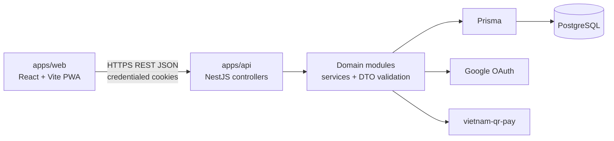
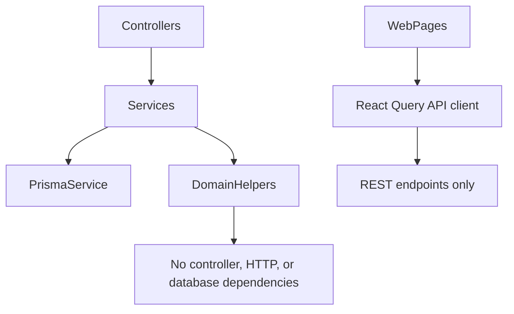

# Architecture Spine - Anh Hoa Admin MVP

## Design Paradigm

Layered modular monolith with a REST boundary.





## Invariants & Rules

### AD-1 - Workspace and application boundary [ADOPTED]

- **Binds:** all implementation units
- **Prevents:** a coupled frontend/backend, duplicate dependency configuration, or web access to database code
- **Rule:** The repository is a pnpm workspace orchestrated by Turborepo. `apps/web` contains only the React/Vite PWA; `apps/api` contains only NestJS, Prisma and server rules. Shared packages may contain pure TypeScript contracts/utilities only and may not import either app.

### AD-2 - API owns business state [ADOPTED]

- **Binds:** FR-2 through FR-11
- **Prevents:** invoice, audit, QR, or transition rules diverging between browser and server
- **Rule:** `apps/api` is the sole owner of the Prisma schema, migrations, PostgreSQL access, money calculation, invoice snapshots, state transitions, audit writes and VietQR content. `apps/web` reads/mutates data only through REST and treats API responses as authoritative.

### AD-3 - Domain modules and dependency direction [ADOPTED]

- **Binds:** FR-1 through FR-11
- **Prevents:** cross-domain controller calls and circular ownership of invoice data
- **Rule:** Nest modules are `auth`, `admins`, `classes`, `students`, `invoice-template`, `invoices`, `bank-accounts`, and `reports`. Controllers delegate to their module service. Services may depend on Prisma and narrowly exported services/helpers from another domain, never another domain's controller. `invoices` owns invoice line items, snapshots, payment state and audit fields; `reports` is read-only over completed invoices.

### AD-4 - Cookie session authentication [ADOPTED]

- **Binds:** FR-1 and every authenticated endpoint
- **Prevents:** tokens in browser storage, client-side email authorization, and inconsistent admin identity
- **Rule:** The API completes Google OAuth, allows only normalized emails in `ADMIN_EMAILS`, upserts the Admin identity, and issues the session JWT in a `Secure`, `httpOnly`, `SameSite=Lax` cookie. Web bootstraps identity through `GET /auth/me` and sends credentialed requests; it never reads, persists or refreshes tokens in JavaScript. Credentialed CORS accepts only configured `WEB_ORIGIN`; OAuth redirects use configured allowlisted URLs; unsafe requests require origin validation and a double-submit CSRF token.

### AD-5 - REST contract and validation [ADOPTED]

- **Binds:** all API consumers and FR-1 through FR-11
- **Prevents:** ad hoc RPC endpoints, incompatible request validation, and mutation behavior that differs by UI surface
- **Rule:** The API serves REST JSON under `/auth`, `/classes`, `/students`, `/invoice-template`, `/invoices`, `/bank-accounts`, and `/reports`. `POST /invoices/batch-preview` is the authoritative preflight for batch creation and returns the eligible count plus categorized skip counts for the submitted month/scope. Controllers validate all mutation DTOs; client-side validation is advisory. Mutations return the current resource or an explicit action result; errors use one JSON shape: `{ error: { code, message, fieldErrors? } }`.

### AD-6 - Money, identifiers and temporal data [ADOPTED]

- **Binds:** FR-2, FR-5 through FR-11
- **Prevents:** float rounding, incompatible month encodings, and unsafe money serialization
- **Rule:** Monetary values are non-fractional VND persisted as PostgreSQL `BIGINT` and exposed as safe JavaScript JSON integers. IDs are UUID strings. `billingMonth` is a date-only first-of-month value in PostgreSQL and is exposed as `YYYY-MM`; all timestamps are UTC ISO 8601 strings. Invoice total is calculated by API from line items, never trusted from web input.

### AD-7 - Invoice lifecycle and immutable snapshots [ADOPTED]

- **Binds:** FR-6, FR-7, FR-8, FR-10, FR-11
- **Prevents:** duplicate monthly invoices, mutable payment instructions, and historical invoices changing after source data changes
- **Rule:** PostgreSQL enforces unique `(studentId, billingMonth)`. Batch creation, class transfer and completion run in database transactions. A newly created invoice is `DRAFT`; only `DRAFT` is editable; `DRAFT -> PENDING` requires a total greater than zero and an active selected Bank Account for bank transfer, while cash requires no Bank Account. `PENDING` locks payment data and can only return to `DRAFT`; only `PENDING -> COMPLETED` is permitted; `COMPLETED` is read-only. Creation copies student, class, template line and chosen bank-account snapshots; QR is built only from invoice snapshots. Completion is idempotent and records the confirming Admin and timestamp exactly once.

### AD-8 - Active records and historical references [ADOPTED]

- **Binds:** FR-2, FR-3, FR-4, FR-9
- **Prevents:** destructive data loss and inactive records entering new billing flows
- **Rule:** Classes, Students and Bank Accounts are retained with status rather than hard deleted. Only active Classes can receive students or create new invoices; only active Students with an active Class are eligible for batch invoice creation; only active Bank Accounts can be selected by a `DRAFT` invoice. Snapshotted inactive records remain displayable for `PENDING` and `COMPLETED` invoices.

### AD-9 - Server state is mutation truth [ADOPTED]

- **Binds:** FR-4, FR-6, FR-8 and UX submission states
- **Prevents:** duplicate operations on retries and UI treating a timeout as a failed mutation
- **Rule:** Each high-impact mutation (batch invoice creation, whole-class transfer, invoice completion) requires a client-generated UUID `Idempotency-Key`, which is also its operation ID and is retained by web before submission. The API scopes it to authenticated Admin + route, stores a request fingerprint and final response atomically with the mutation, replays the stored response for an identical retry, and returns conflict for a reused key with a different request. `GET /operations/:operationId` returns the stored outcome for the authenticated Admin; records expire only after configured retention. On an uncertain client outcome, web fetches that known operation ID before offering another submission; React Query invalidation occurs only after a confirmed response or reconciliation.

### AD-10 - Report snapshot projection [ADOPTED]

- **Binds:** FR-9, FR-10, FR-11
- **Prevents:** report totals or account labels changing after source Bank Accounts are edited or deactivated
- **Rule:** `reports` aggregates only `COMPLETED` invoices and uses each invoice's snapshotted payment method and bank-account identity/display fields, never mutable Bank Account data. Monthly responses contain total collected, cash total, transfer total, and transfer totals grouped by bank-account snapshot.

### AD-11 - Verification boundary [ADOPTED]

- **Binds:** all domain modules
- **Prevents:** testing only happy paths or making web tests the sole proof of finance behavior
- **Rule:** Put pure calculation/transition rules under API unit tests. Use PostgreSQL-backed API integration tests for batch uniqueness, snapshot retention, state transitions, idempotent completion and whole-class transfers. Add Playwright coverage for the web's primary invoice and report flows after those surfaces exist.

## Consistency Conventions

| Concern | Convention |
| --- | --- |
| Naming | Database models and TypeScript domain types use singular PascalCase; REST resources use plural kebab-case paths; enum values are uppercase; UI text is Vietnamese. |
| Data & formats | REST JSON uses camelCase. List endpoints return `{ data, meta }`; action endpoints return `{ data }`. Never serialize database `BIGINT` directly; map it to safe JSON integer values at the API boundary. |
| State & cross-cutting | API configuration is environment-driven and validated at bootstrap. Auth guard is default for operational routes. React Query keys start with the REST resource name and mutations invalidate affected resource keys. |
| Migrations & seed | Prisma schema and migrations live only in `apps/api/prisma`. Production-like environments apply committed migrations; `prisma db push` is local-prototyping only. Seeds are explicit development/test commands. |

## Stack

| Name | Version |
| --- | --- |
| Node.js | 22 LTS |
| pnpm | 9.x |
| Turborepo | 2.x |
| TypeScript | 5.x strict |
| Web | React 19 + Vite 8 + Tailwind CSS 4 |
| Web data | TanStack React Query 5 |
| UI primitives | shadcn/ui + Base UI + tw-animate-css |
| API | NestJS 11 |
| ORM | Prisma 7 |
| Database | PostgreSQL 16+ |
| Authentication | passport-google-oauth20 + JWT cookie session |
| QR | vietnam-qr-pay + qrcode.react |
| API tests | Jest + Supertest + PostgreSQL test database |
| E2E tests | Playwright |

## Structural Seed

```text
anhhoa/
  apps/
    api/
      prisma/                 # schema, migrations, development/test seeds
      src/
        modules/              # auth, admins, classes, students, invoice-template,
                              # invoices, bank-accounts, reports
        common/               # guards, DTO/error mapping, config, Prisma service
    web/
      src/
        app/                  # router, providers, layout
        features/             # domain screens, forms, queries and mutations
        components/           # shared UI components only
        lib/                  # REST client, formatters, query keys
      public/                 # PWA manifest and icons
  packages/
    api-client/               # optional generated/shared REST types, no server imports
  package.json
  pnpm-workspace.yaml
  turbo.json
```

```mermaid
erDiagram
  ADMIN ||--o{ INVOICE : creates
  ADMIN ||--o{ INVOICE : completes
  CLASS ||--o{ STUDENT : current_class
  STUDENT ||--o{ INVOICE : billed_for
  INVOICE ||--|{ INVOICE_LINE_ITEM : contains
  BANK_ACCOUNT ||--o{ INVOICE : selected_for
  INVOICE_TEMPLATE ||--|{ INVOICE_TEMPLATE_ITEM : contains
```

## Capability to Architecture Map

| Capability / Area | Lives in | Governed by |
| --- | --- | --- |
| Google allowlisted Admin sign-in | `auth`, `admins`, web auth bootstrap | AD-2, AD-4, AD-5 |
| Classes, Students and transfers | `classes`, `students` | AD-2, AD-3, AD-8, AD-9 |
| Shared invoice template | `invoice-template` | AD-2, AD-3, AD-6 |
| Batch creation and invoice editing | `invoices`, web invoice feature | AD-2, AD-5, AD-6, AD-7, AD-9 |
| Payment confirmation and audit | `invoices` | AD-4, AD-7, AD-9 |
| Bank accounts and VietQR | `bank-accounts`, `invoices` | AD-2, AD-6, AD-7, AD-8 |
| Monthly reports | `reports`, web report feature | AD-3, AD-6, AD-7, AD-10 |
| Responsive PWA UI | `apps/web` | AD-1, AD-2, UX spines |

## Deferred

- Deployment provider, container topology, reverse proxy, backup and monitoring: owner-operated infrastructure is intentionally outside this spine; revisit before production deployment.
- Public API versioning and external API consumers: no external client exists in MVP.
- Background jobs and bank-transaction reconciliation: MVP requires manual confirmation only.
- Generated API client: start with manually maintained typed REST calls; introduce generation only if contract duplication becomes material.
