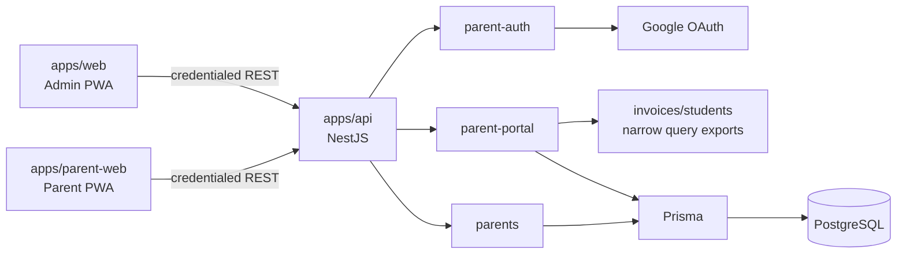
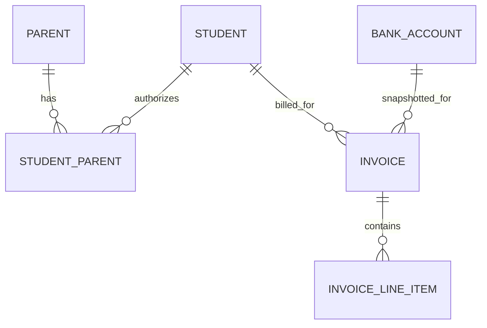

# Architecture Spine - Anh Hoa Parent PWA

## Design Paradigm

Layered modular monolith with isolated REST clients.



```mermaid
flowchart TD
  ParentController[Parent controllers] --> ParentPortalService[parent-portal service]
  ParentPortalService --> ParentGuards[Parent auth + authorization guards]
  ParentPortalService --> QueryExports[Exported invoice/student query services]
  ParentPortalService --> PrismaService[Prisma service]
  ParentAuthController[parent-auth controller] --> ParentAuthService[parent-auth service]
  ParentAuthService --> ParentService[parents service]
  ParentWebPage[parent-web page] --> ParentQuery[Parent REST query client]
  ParentQuery --> ParentRoutes[/api/parent only]
```

## Inherited Invariants

| Inherited | From parent | Binds here |
| --- | --- | --- |
| AD-1 | Admin MVP spine | pnpm/Turborepo workspace; `apps/api` owns server code; `apps/parent-web` is a separate frontend application. |
| AD-2 | Admin MVP spine | API owns Prisma, money, invoice snapshots, QR content and all Parent authorization decisions. |
| AD-3 | Admin MVP spine | Controllers delegate to services; Parent modules may not call Admin controllers. |
| AD-4 | Admin MVP spine | Cookie authentication, allowlisted origins, OAuth redirect validation, origin validation and double-submit CSRF. |
| AD-5 | Admin MVP spine | REST JSON, DTO validation and common error envelope. |
| AD-6 | Admin MVP spine | UUID identifiers, `YYYY-MM` billing months, UTC timestamps and VND `BIGINT` boundary mapping. |
| AD-7 | Admin MVP spine | PostgreSQL-enforced invoice lifecycle: `DRAFT` is editable; `DRAFT -> PENDING`; `PENDING -> DRAFT` or `PENDING -> COMPLETED`; `COMPLETED` is read-only. Parent displays only currently `PENDING` and `COMPLETED` invoices. |
| AD-8 | Admin MVP spine | Status-based retention for Classes, Students and Bank Accounts. |
| AD-9 | Admin MVP spine | Idempotency and operation reconciliation pattern for retryable high-impact mutations. |
| AD-10 | Admin MVP spine | Reports remain Admin-only projections of completed invoice snapshots. |
| AD-11 | Admin MVP spine | API unit, PostgreSQL integration and Playwright verification boundary. |

## Invariants & Rules

### AD-12 - Isolated Parent application boundary [ADOPTED]

- **Binds:** FR-3 through FR-7
- **Prevents:** Parent and Admin routes, service workers, browser state, or business clients becoming coupled
- **Rule:** `apps/parent-web` is a separate React/Vite PWA with its own router, manifest, service worker, REST client and React Query cache. It may share only pure TypeScript utilities/contracts from `packages`; it must not import `apps/web`, reuse Admin routes, or access API/database code directly.

### AD-13 - Parent domain ownership and dependency direction [ADOPTED]

- **Binds:** FR-1 through FR-7
- **Prevents:** a Parent model copied into `students`, Parent controllers calling Admin controllers, or duplicated invoice/payment rules
- **Rule:** `parents` owns `Parent` and `StudentParent` lifecycle. `parent-auth` owns Parent Google OAuth and Parent sessions. `parent-portal` owns Parent-authorized read DTOs and may depend only on Prisma plus narrowly exported query services from `parents`, `students` and `invoices`; it never calls controllers or writes invoice lifecycle data. Admin grant/revoke endpoints delegate to `parents` service.

### AD-14 - Parent identity and authorization [ADOPTED]

- **Binds:** FR-1, FR-2, FR-3
- **Prevents:** authorization by unverified email, account takeover after Google identity changes, and stale Parent access after revoke
- **Rule:** `Parent` binds normalized verified Google email to Google subject on the first authorized login. Subsequent login requires the stored subject to match; a changed subject or reassigned email is denied until an Admin revokes and grants the email again. `StudentParent` is a retained many-to-many relation with `ACTIVE` and `REVOKED` status; PostgreSQL enforces unique `(parentId, studentId)`, grant creates or reactivates that one relation, revoke changes only `ACTIVE` to `REVOKED`, and authorization accepts only `ACTIVE`. Every Parent request derives identity from the Parent session and checks active Parent plus active `StudentParent` authorization server-side.

### AD-15 - Parent session and mutation boundary [ADOPTED]

- **Binds:** FR-1, FR-2, FR-3
- **Prevents:** cookie/session confusion across user surfaces and CSRF on Parent authorization changes
- **Rule:** Parent OAuth uses distinct configured callback and Parent origin. OAuth `state` is cryptographically random, bound to the initiating Parent browser and configured callback, single-use and expiring; invalid, expired, mismatched or provider-failed callbacks issue no Parent session. The Parent cookie is issued only after verified email, stored-subject checks, active Parent status and at least one active `StudentParent` link pass. Parent sessions use a distinct `Secure`, `httpOnly`, `SameSite=Lax` cookie scoped to the Parent surface; it is never readable by JavaScript or accepted as an Admin session. Admin-only grant, revoke and bulk grant/revoke endpoints require origin validation, double-submit CSRF and an `Idempotency-Key` UUID; the API scopes it to authenticated Admin plus route, atomically stores a request fingerprint/final response and exposes the inherited `GET /operations/:operationId` reconciliation flow.

### AD-16 - Parent portal REST read boundary [ADOPTED]

- **Binds:** FR-2, FR-4, FR-5, FR-6, FR-7
- **Prevents:** Parent use of Admin endpoints, data enumeration, and payment data leaking for ineligible invoices
- **Rule:** Parent routes are namespaced under `/api/parent`: `/me`, `/students`, `/invoices`, `/invoices/:invoiceId`, and `/invoices/:invoiceId/payment`. Lists use `{ data, meta }`, have bounded pagination, stable sort and validated filters. The portal returns only `PENDING` and `COMPLETED` invoices authorized by current `StudentParent` links. The payment route returns only locked snapshot data for an authorized `PENDING` + `TRANSFER` invoice with a valid payment snapshot.

### AD-17 - Revoke and protected client state [ADOPTED]

- **Binds:** FR-1, FR-2, FR-3
- **Prevents:** Parent data persisting in the PWA after logout, expiry, authorization denial, or a revoke detected by the client
- **Rule:** Parent protected REST responses are never stored in service-worker caches. `apps/parent-web` clears Parent query/cache state on logout and `401`. It revalidates session/authorization when the app enters foreground, the tab receives focus, and before rendering a protected view; a denied revalidation clears the active view and routes to the safe signed-out state. The server denies every request after revoke.

### AD-18 - Snapshot-only payment guidance [ADOPTED]

- **Binds:** FR-6, FR-7
- **Prevents:** current Bank Account data replacing historical instructions, QR/deep-link logic split across clients, and a payment action mutating an invoice
- **Rule:** Before `DRAFT -> PENDING` for `TRANSFER`, `invoices` validates and locks snapshot total VND, bank identifier, account number, account-holder name, transfer content, and student/class display values; missing or invalid required fields reject the transition. `apps/api` builds all Parent payment DTOs, VietQR PNG and deep-link payloads solely from those locked fields. Parent payment actions are read-only. Bank deep-link templates are server-owned, versioned configuration; unsupported bank/device combinations expose only VietQR and copyable fields.

## Consistency Conventions

| Concern | Convention |
| --- | --- |
| Naming | Prisma models and TypeScript domain types are singular PascalCase. REST paths are plural kebab-case except singleton `/me`. Parent DTOs are suffixed `ParentDto` when a similarly named Admin DTO exists. |
| Data and formats | Parent REST JSON is camelCase and uses the inherited `{ data, meta }` list and `{ data }` action envelopes. Parent invoice DTOs omit Admin audit data and mutable source Bank Account records. |
| State and cross-cutting | Parent React Query keys begin with `parent`. Protected query data is memory-only and is cleared before sign-out routing. `401` is an authorization-state transition, not a retryable query error. |
| Configuration | Parent origin, OAuth callback allowlist, session cookie name and bank deep-link configuration are environment/server configuration validated at API bootstrap. |

## Stack

| Name | Version |
| --- | --- |
| Node.js | 22 LTS (inherited) |
| TypeScript | 5.x strict (inherited) |
| Parent web | React 19 + Vite 8 + Tailwind CSS 4 (inherited) |
| Parent web data | TanStack React Query 5 (inherited) |
| API | NestJS 11 + Prisma 7 (inherited) |
| Database | PostgreSQL 16+ (inherited) |
| Authentication | passport-google-oauth20 + JWT cookie session (inherited) |
| QR | vietnam-qr-pay (API) + qrcode.react (Parent display) (inherited) |

## Structural Seed

```text
anhhoa/
  apps/
    api/
      prisma/                         # Parent, StudentParent schema and migrations
      src/
        modules/
          parents/                    # Parent + StudentParent lifecycle
          parent-auth/                # Parent Google OAuth and session
          parent-portal/              # authorized Parent read model and payment DTOs
    parent-web/
      src/
        app/                          # Parent router, providers and session bootstrap
        features/                     # students, invoices, payment guidance
        lib/                          # Parent REST client and `parent` query keys
      public/                         # Parent PWA manifest and icons
  packages/
    api-client/                       # optional pure shared REST contracts only
```



## Capability to Architecture Map

| Capability / Area | Lives in | Governed by |
| --- | --- | --- |
| Admin grants/revokes Parent access | `parents`, Admin PWA parent-management feature | AD-13, AD-14, AD-15, AD-9 |
| Parent Google login and session | `parent-auth`, `apps/parent-web` bootstrap | AD-4, AD-14, AD-15 |
| Authorized student and invoice browsing | `parent-portal`, `apps/parent-web` invoice features | AD-12, AD-13, AD-16, AD-17 |
| Payment sheet, VietQR and PNG download | `parent-portal`, `invoices`, Parent payment feature | AD-2, AD-7, AD-16, AD-18 |
| Bank deep-link fallback | server bank-link configuration, Parent payment feature | AD-18 |
| Authorization/revoke verification | API integration tests and Parent PWA E2E | AD-11, AD-14, AD-15, AD-17 |

## Deferred

- Exact Admin and Parent subdomain values, API host, CORS allowlist and cookie `Domain`/`Path`: deployment-specific configuration must be fixed before production setup, while AD-15 fixes the isolation requirement now.
- Supported bank/device/browser matrix, URI templates, revalidation cadence and owner: no bank is enabled for deep link until its configuration has a verified support matrix; VietQR and copy fields remain available.
- Email correction and shared-inbox operating procedure: product/operations decision; the identity-binding and deny-on-subject-change rule remains fixed.
- Audit access, retention, monitoring and incident ownership: explicitly outside the small Parent PWA release as accepted by the PRD; revisit before any broader external rollout.
- Deployment provider, container topology, backup and monitoring: inherited Admin spine deferral; revisit before production deployment.
