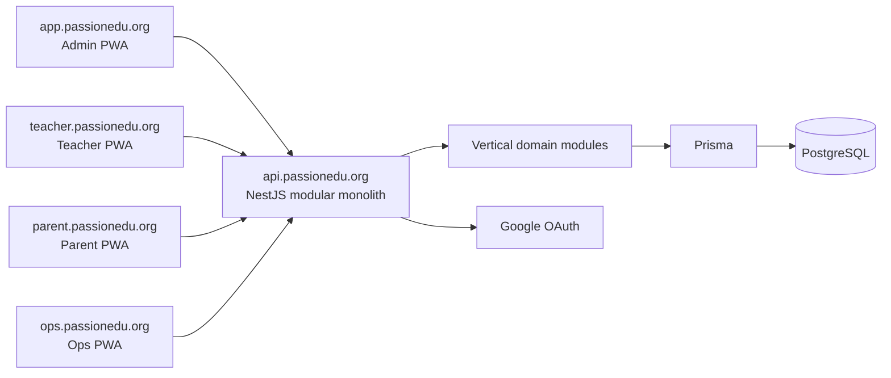
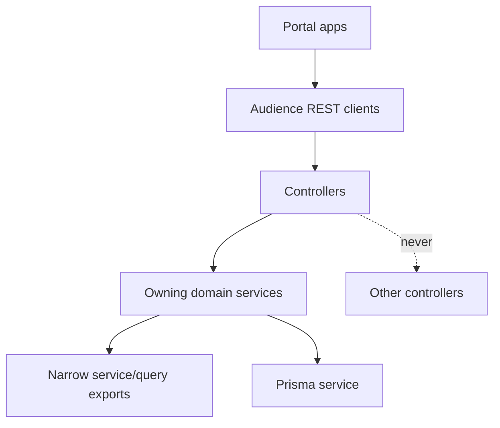
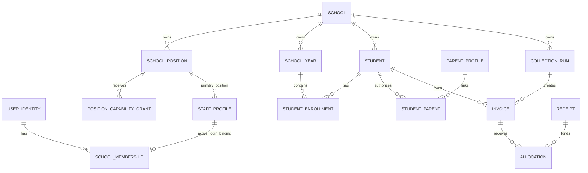
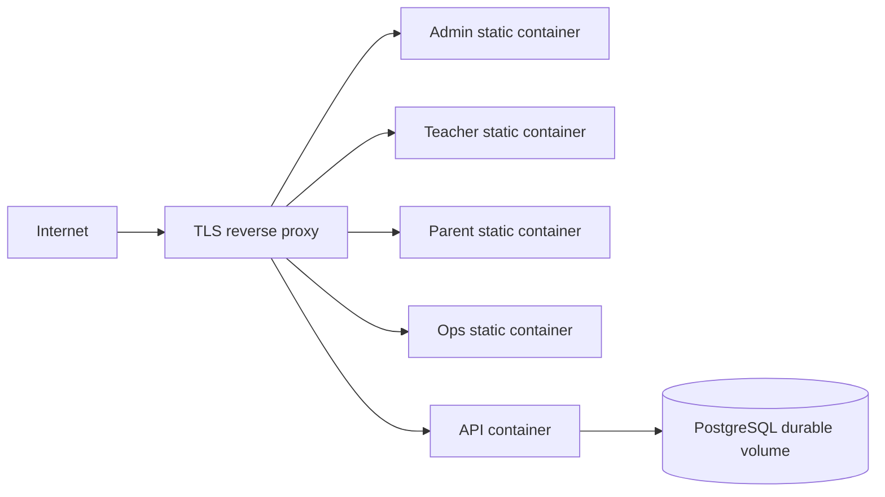

# Architecture Spine - PassionEdu multi-school operations platform

## Design Paradigm

Vertical-slice modular monolith with isolated portal clients. NestJS domain modules own writes and expose narrow service/query contracts; controllers are HTTP adapters only. Admin, Teacher, Parent and Ops are separate React/Vite applications that only consume REST.





## Invariants & Rules

### AD-1 - Workspace and portal boundaries [ADOPTED]

- **Binds:** all implementation units
- **Prevents:** frontend access to server data, cross-audience router/session/cache coupling, and shared business logic in browsers
- **Rule:** The pnpm/Turborepo workspace contains `apps/api`, `apps/web` for Admin, `apps/teacher-web` for Teacher, `apps/parent-web` for Parent, and `apps/ops-web` for Operations. Portal applications are separately built/deployed and may share only pure contracts, formatters and stateless UI primitives from `packages`; they never import another app or API internals. Attendance, handover and daily-journal UI live only in `teacher-web`; an Admin actor must use this audience and meet its operational authorization to perform them.

### AD-2 - API ownership and modular dependency direction [ADOPTED]

- **Binds:** FR-1 through FR-17
- **Prevents:** duplicated policy/money rules, controller-to-controller coupling, and ambiguous aggregate ownership
- **Rule:** `apps/api` solely owns Prisma, migrations, PostgreSQL, authorization, policy evaluation, money calculation, state transitions, snapshots, audit and Operations. Domain modules own their aggregate writes: `identity`, `schools`, `memberships`, `authorization`, `school-features`, `roster`, `workforce`, `timekeeping`, `payroll`, `settings`, `finance`, `attendance`, `parents`, `parent-auth`, `parent-portal`, and `operations`. Controllers call only their owning service; a service may use Prisma and narrowly exported service/query contracts, never another controller.

### AD-3 - School-scoped authorization context [ADOPTED]

- **Binds:** FR-1 through FR-17
- **Prevents:** cross-tenant access through UUIDs, filters, route parameters, headers or stale browser selection
- **Rule:** `School` is the tenant root. Staff operational routes carry `/schools/:schoolId/` and resolve the active StaffProfile, SchoolPosition, SchoolMembership login binding and Position capability per request; Position name, client-provided capability and browser state are never authorization proof. Parent routes carry `/api/parent/schools/:schoolId/`; one `ParentSchoolContext` resolver verifies parent audience, bound ParentProfile and active StudentParent in that School before any scoped query. Every business query, write, unique constraint, audit record and Operation scopes `schoolId`; updates/deletes match both record ID and school ID in one transaction. Client-provided school context is a selector, never authorization proof; no resolver may derive authorization from an unscoped resource UUID.

### AD-4 - Identity, audience and portal session isolation [ADOPTED]

- **Binds:** FR-1, FR-2, FR-6, FR-16, FR-17
- **Prevents:** global Admin privilege, cross-portal cookies, subject/email takeover and stale Parent access
- **Rule:** Google OAuth creates/binds global `UserIdentity`; Teacher access requires an active StaffProfile, Position, membership login binding and route capability resolved per request. `parents` owns ParentProfile and exports the only atomic pending-email bind/reassign command used by `parent-auth`: normalized verified email lookup, unique Google subject and one-to-one identity binding, active StudentParent recheck immediately before session issue, and audited revoke before reassignment. Parent read models enforce retention server-side: operational/sensitive data expires 30 calendar days after enrollment `endedOn`; issued finance remains while unsettled, then uses versioned ParentAccessPolicy with a 12-month default. The fixed hosts are `app.passionedu.org`, `teacher.passionedu.org`, `parent.passionedu.org`, `ops.passionedu.org` and `api.passionedu.org`; every audience has its own callback allowlist, host-only `Secure`/`httpOnly`/`SameSite=Lax` cookie, session audience and origin allowlist. A session cookie is accepted only by its audience. `parent-web` never service-worker caches authenticated Parent responses, payment instructions, daily-journal media or evidence URLs; it clears memory/query state on logout, expiry, `401` or revoke.

- **Clarification:** A StaffProfile becomes an operational actor only through an audited same-School binding to one active SchoolMembership/UserIdentity. Attendance, DailyJournal and class leave routes additionally require the `teacher` audience, route capability and an effective Class assignment for the requested Class and as-of date. `HANDOVER_WRITE` requires the `teacher` audience and its School-scoped capability, but no Class assignment; each request still re-authorizes Staff, School, Student enrollment, date, HandoverPolicy and evidence. Revoke of the binding, membership, Position, capability or required assignment denies the next request.

### AD-5 - Operations control plane [ADOPTED]

- **Binds:** FR-1 through FR-3
- **Prevents:** Platform Operator access to School business data, partial owner bootstrap and destructive School deletion
- **Rule:** `SUPERADMIN_EMAIL` from environment may bootstrap only `PlatformOperatorGrant`; Ops authorizes through audience `ops` plus that grant and has no `OpsUser` model. Provisioning atomically creates/reuses pending owner UserIdentity, SchoolMembership, active StaffProfile, one seeded primary SchoolPosition and its audited login binding; verified Google login binds the subject. Schools are suspended/reactivated, never hard-deleted; every School-scoped resolver rejects a suspended School on the next business request while the global identity session can remain valid elsewhere. A Platform grant never implies School access.

- **Clarification:** Provisioning requires an `Idempotency-Key`. Its Operation scopes PlatformOperatorGrant, route and request fingerprint; an identical retry replays the outcome and a changed fingerprint conflicts.

### AD-6 - Temporal roster and typed policy ownership [ADOPTED]

- **Binds:** FR-4 through FR-6, FR-12, FR-13
- **Prevents:** overwriting roster history, policy JSON blobs and mutable historical operational meaning
- **Rule:** `SchoolYear` is the data boundary; a School has at most one active year, Classes belong to it, and `StudentEnrollment` plus class assignment use effective dates/audit rather than mutable current-state fields. The business timezone is `Asia/Ho_Chi_Minh`; effective intervals are `[effectiveFrom, effectiveTo)`. Finance receives a roster-owned as-of snapshot at CollectionRun generate/issue and persists source IDs/effective facts rather than recomputing from current rows. Student codes are server-generated, School-unique and never reused. Settings are typed domain models with version/effective date/audit; policy changes do not rewrite snapshotted history. Retain Student, Parent, Staff and enrollment through lifecycle status, never hard delete.

### AD-7 - Finance obligation and ledger model [ADOPTED]

- **Binds:** FR-7 through FR-11
- **Prevents:** parallel finance lifecycles, mutable issued obligations, float errors, payment double-posting and live account data changing history
- **Rule:** VND persists as PostgreSQL `BIGINT` and crosses REST only as safe JSON integers. Every CollectionRun, Invoice, DebtTransfer and settlement belongs to one SchoolYear; no debt auto-carries to a new SchoolYear. Finance owns CollectionRun lifecycle `DRAFT -> READY -> GENERATED -> CLOSED`: GENERATED locks rule/scope snapshots and only allows one new DRAFT Invoice for an eligible Student without one; CLOSED blocks create/edit. Preview and generate share the same server selection policy and categorized skips. An Invoice is unique by `(schoolId, studentId, collectionRunId)`; obligation content and Payment instruction are immutable after issue, while only server workflows may derive `PAID` settlement or transition to `VOIDED` before any allocation. `PARTIALLY_PAID` does not exist. Receipt, Allocation, Reversal, Refund and DebtTransfer are append-only finance records. One finance posting boundary serializes every settlement writer with a consistent lock order: a Receipt may settle one or more Invoices only for one Student in one School and SchoolYear, and only when every target is settled exactly to its outstanding amount; partial, excess, unallocated and mixed-Student posting is rejected. Existing limits reject source/Invoice over-application, cross-Student use and voided targets. A School configures multiple concurrent `PrepaidPaymentPromotionProgram` records, each explicitly active/deactivated, with a fixed consecutive calendar-month term, selected tuition and/or other Receivables, and either percentage or whole-VND reduction from original price. A program never stacks with `DiscountPolicy`. After direct Parent agreement, only a School Admin selects the program and start month, creating a dedicated `PREPAID` CollectionRun and one source DRAFT Invoice containing every covered future receivable-period fact. The source Invoice settles exactly, with no excess or generic balance. Only after that source Invoice is fully paid may the server issue `StudentPromotionalCoverage` from its immutable source facts and Receipt provenance; no actor creates coverage directly. Database and owning command prevent issued overlap for the same Student, SchoolYear, Receivable and period. Ordinary monthly runs skip only issued covered Student/Receivable/period facts with `COVERED_BY_PROMOTIONAL_COVERAGE`; other eligible charges remain billable. Coverage retains issued price, discount, service interval, calendar and paid-source snapshots; catalog, class or service changes require authorized audited correction/refund review, never automatic conversion. Withdrawal/transfer/eligible service-cancellation refund preview uses each coverage fact's immutable snapshot, excludes the effective date, floors VND by remaining eligible School-calendar operating days and caps refund to remaining paid source. Posted refund stores calculated/approved amount, override reason when different, coverage/Invoice/Receipt provenance and approval outcome without mutating source facts. DebtTransfer atomically reduces its source outstanding before exposing `PRIOR_DEBT`, preventing double collection. `DIRECT` permits School Admin/Finance Manager reversal with reason; `SCHOOL_ADMIN_APPROVAL` requires a Finance Manager request and a different School Admin identity approval, never self-approval. Paid/outstanding status is derived from validated ledger records, never set by clients. Finance source and Payment instruction data are snapshotted at issue; Parent receives a minimal read model only.

- **Clarification:** Close is rejected while any Invoice in the run is `DRAFT`; every Invoice must be `ISSUED`, `PAID` or `VOIDED` before the run can become `CLOSED`. Normal Receipt settlement requires the same Student, School and SchoolYear as every target Invoice. A StaffProfile binding is one active binding per StaffProfile and per SchoolMembership; rebinding requires audited revocation of the prior binding and never rewrites assignment history. Platform Operations are the sole exception to School-scoped Operation: provision uses a PlatformOperatorGrant-scoped Operation before a School exists, and `GET /operations/:operationId` authorizes that same grant context. Promotional coverage is scoped to SchoolYear and is created through a `PREPAID` source DRAFT Invoice containing its facts. Each fact snapshots Receivable, period, service interval contained by that period, price/discount, calendar version/timezone and source issued Invoice/fully settled Receipt provenance. A coverage fact with no eligible operating day is rejected; refund rejects a non-positive denominator and caps both calculated and approved totals to the fact's remaining paid source after prior refund/reversal.

- **Supersession (2026-09-10):** The preceding `DiscountPolicy` and `PrepaidPaymentPromotionProgram` clauses are superseded by versioned School-scoped `PromotionPolicy`. A policy version owns one or more same-School Receivable targets with typed unit/applied quantity, optional consecutive-period validation, fixed-VND or percentage discount, fulfillment mode, effective interval, priority, stacking/exclusivity and optional `StudentPromotionAssignment`. Server evaluation occurs at DRAFT and is repeated inside the Issue transaction; each application snapshots policy version, target, outcome, discount and assignment provenance. Fixed VND applies before percentage, then priority and policy ID provide deterministic ordering; target discount is capped at gross and cannot create a negative line, generic credit or balance. `PREPAID_COVERAGE` is a fulfillment mode, not a separate program: only School Admin selects an eligible policy/start period after direct Parent agreement, creating a dedicated `PREPAID` CollectionRun/source DRAFT Invoice. Exact PAID settlement is required before Finance issues StudentPromotionalCoverage and per-period facts. Each fact snapshots policy version, Receivable, period, service interval, price/discount, calendar version/timezone and issued Invoice/fully settled Receipt provenance; normal runs skip only those covered facts. Coverage overlap and refund limits remain enforced per Student/SchoolYear/Receivable/period, and catalog, policy, assignment, class or service changes never rewrite issued facts.

- **Supersession (2026-09-16):** The preceding normal exact-settlement, `PAID`/`VOIDED` Invoice and multi-Invoice Allocation clauses are superseded. The finance posting boundary closes exactly one `ISSUED` Invoice with the actual VND Receipt amount and derives immutable `EXACT`, `SHORTFALL` or `OVERPAYMENT` outcome. A non-exact close atomically appends one source-linked `SettlementDifference`; the next eligible same-Student, same-School, same-SchoolYear `MONTHLY` Invoice DRAFT alone materializes its remaining amount as `SHORTFALL_CARRY` or `OVERPAYMENT_CARRY`. Negative carry is capped so the target Invoice never becomes negative; an unapplied remainder stays source-linked for a later eligible run. Generic balance, Student prepayment, unallocated Receipt and cross-Student/School/SchoolYear application are forbidden. An issued-content correction creates a replacement Invoice and atomically changes its source to `CANCELLED`, preserving immutable snapshots and revision lineage. It is the sole exception to one Invoice per Student/run: replacement has `revisesInvoiceId` to exactly one same-School/Student/run `CANCELLED` source; a second replacement, missing lineage or cross-graph lineage is rejected by database/service constraints. A confirmed source Receipt is represented on the replacement only through append-only settlement-transfer projection; it is never rewritten. The shared lock order, transaction, source/remaining limit and Operation idempotency checks reject duplicate closes, duplicate materialization, cancelled targets and concurrent over-application. `CLOSED` or `CANCELLED` Invoice satisfies CollectionRun close; Parent projections expose only the current effective Invoice, never internal correction provenance.

- **Correction (2026-09-16):** The preceding dedicated `PREPAID` CollectionRun/source Invoice clauses are also superseded. `PREPAID_COVERAGE` is a `PromotionPolicy` fulfillment mode within the normal `MONTHLY` CollectionRun, never a separate run. After direct Parent agreement, a Finance Manager or School Admin selects an eligible policy version for one or more Students while reviewing the authoritative preview; the start period is that run's `billingMonth`. The one DRAFT Invoice for each selected Student includes the covered future receivable-period facts and may include non-covered Receivables of the open billing month, but never unrelated future charges. Coverage issues only when that Invoice closes with `EXACT`; no actor creates coverage directly. `StudentPromotionalCoverage` and each fact snapshot policy version, Receivable, period, contained service interval, price/discount, calendar version/timezone and paid Invoice/Receipt provenance. Normal runs skip only issued covered facts; overlap for the same Student/SchoolYear/Receivable/period and facts without an eligible operating day are rejected. Catalog, policy, assignment, class or service changes never rewrite issued facts. Refund uses each fact's paid snapshot/calendar service interval, rejects a non-positive denominator and caps calculated and approved totals to its remaining paid source after prior refund/reversal. A CollectionRun cannot close while it contains a `DRAFT` Invoice; each Invoice must be `ISSUED`, `CLOSED` or `CANCELLED`. Parent projections expose only the current effective Invoice and its permitted payment/settlement data, never internal correction rationale, SettlementDifference or transfer provenance.

### AD-8 - Transaction, idempotency and audit boundary [ADOPTED]

- **Binds:** FR-1 through FR-13
- **Prevents:** duplicate batch/ledger actions after timeout and untraceable privilege/policy/money changes
- **Rule:** State-changing workflows that affect multiple records run in PostgreSQL transactions. CollectionRun generation, `PREPAID_COVERAGE` policy selection, roster transition/close year, SchoolPosition/capability lifecycle, Staff primary Position/login-binding changes, issue, actual-receipt close, carry materialization, Invoice revision/cancellation/settlement transfer, reversal/refund, approval and Parent leave mutations require client UUID `Idempotency-Key`. `Operation` scopes School + route + actor type/reference (`SCHOOL_MEMBERSHIP`, `PARENT_PROFILE` or `PLATFORM_OPERATOR_GRANT`), with actor UserIdentity when present; it atomically persists a request fingerprint/outcome, replays identical retries and rejects changed reuses. Operation reads authorize the same actor context that created it. Clients reconcile `GET /operations/:operationId` before retry. Audit stores School, actor identity/reference, timestamp, provenance and required reason; Position/capability lifecycle mutations require an audit reason.

### AD-9 - Clean-break target schema [ADOPTED]

- **Binds:** all replacement releases
- **Prevents:** legacy single-school schema/API/UI contaminating tenant or ledger contracts
- **Rule:** Prisma schema, committed migrations, seed and modules implement only the target multi-school model. The old global Admin, invoice template, monthly invoice lifecycle and unscoped resources are removed/replaced rather than run in parallel. Development/test databases reset to the target seed. If operational data exists, stop and create a separate onboarding/migration workstream before implementation.

### AD-10 - Pilot VPS deployment boundary [ADOPTED]

- **Binds:** pilot deployment
- **Prevents:** pilot deployment becoming an implicit production claim or violating portal host/session boundaries
- **Rule:** The pilot runs on one VPS with Docker Compose, building portal/API images from repository source on that host. A TLS reverse proxy routes the fixed portal hosts to separate static portal containers and `api.passionedu.org` to the API; PostgreSQL uses a local durable Compose volume. Secrets are injected outside Git. No container registry, offsite backup, restore drill, production SLO or cloud-provider commitment is required for the pilot. Database migrations are applied before the API version that requires them; destructive migration rollback is forbidden. Public/operational production rollout requires an Architecture Spine update that defines recovery, backup, monitoring, delivery and rollback controls.

### AD-11 - Verification boundary [ADOPTED]

- **Binds:** all releases
- **Prevents:** happy-path-only proof and UI-only validation of tenant/ledger invariants
- **Rule:** Pure transitions/calculations use API unit tests; PostgreSQL integration tests prove tenant isolation, scoped uniqueness, revoke, transactions, ledger concurrency and idempotency. Authorization fixtures prove cross-School Position/capability rejection, deny on inactive Position/Staff/binding, no authorization from legacy preset roles after migration, class restriction for attendance/journal/leave, and same-School cross-class handover with `HANDOVER_WRITE`. Finance integration fixtures cover one-time close of lower/exact/higher actual Receipts, one immutable source-linked SettlementDifference per non-exact close, bounded same-Student/School/SchoolYear next-run carry, no negative target total, and no unallocated/cross-tenant/year carry. They also prove replacement/cancellation lineage, confirmed-Receipt settlement-transfer provenance and no duplicate close/materialization under retry or concurrency. Portal E2E proves audience/session isolation, chooser/switcher, Parent cross-school behavior and that Parent sees only the effective Invoice without internal correction or ledger provenance. E1 tenant-isolation proof gates all subsequent releases.

### AD-12 - Tenant graph integrity [ADOPTED]

- **Binds:** FR-3 through FR-17
- **Prevents:** tenant-owned records carrying a valid school ID while referencing a different School's aggregate
- **Rule:** Tenant-owned relations use composite `(schoolId, id)` parent keys and foreign keys where supported. The owning command verifies the entire graph inside its transaction when a database composite FK cannot express it. Global exceptions are only UserIdentity, ParentProfile and PlatformOperatorGrant; their tenant path is explicit through SchoolMembership or StudentParent. Cross-School graph inserts and joins are negative integration tests.

### AD-13 - Attendance-to-finance adjustment contract [ADOPTED]

- **Binds:** FR-12, FR-13, FR-7 through FR-11
- **Prevents:** duplicated or wrongly targeted meal adjustments and attendance becoming an unapproved pricing engine
- **Supersession (2026-09-21):** `long leave` is not an attendance aggregate. `attendance` owns immutable `AUTO_APPROVED`/`APPROVED` short-leave-day facts and `PRESENT`-conflict exclusions, and never owns receivable selection, tuition reduction, CollectionRun exclusion, return fee or Invoice writes. Leave before the School deadline is auto-approved; pending leave after it requires `LEAVE_REQUEST_DECIDE`, a School-scoped Position capability available to School Admin and Finance Manager. Parent authorization is only to create its own short LeaveRequest through an active StudentParent link. Calendar holidays are excluded. `finance` owns its School-scoped service catalog and `StudentServiceEnrollment`, then maps the same-School leave fact to a Receivable after its catalog exists and materializes a source-linked negative meal adjustment onto the next eligible DRAFT Invoice through an idempotent command keyed by source/day/receivable. The command defines no-target, issued/cancelled target and retry outcomes, records source provenance and never rematerializes an already handled source. `roster` alone owns effective StudentEnrollment `ENROLLED <-> ON_LEAVE` preservation transitions, authorized by `ROSTER_MANAGE`; Finance reads lifecycle snapshots for future-run eligibility. A lifecycle transition never calculates or posts a tuition reduction, return fee or refund. Attendance and handover remain references for Finance `MANUAL` decisions; service enrollment is Finance-owned coverage and none of these facts calculate charges automatically. A manual Saturday charge must validate active StudentServiceEnrollment coverage for that date and rejects duplicate charging for a covered service.

### AD-14 - Attendance and handover evidence lifecycle [ADOPTED]

- **Binds:** FR-12
- **Prevents:** PRESENT or picked-up time without required evidence, Parent/media leaks and indefinite retention of child images
- **Rule:** `attendance` enforces distinct School `AttendancePolicy.photoEvidenceMode` and `HandoverPolicy.photoEvidenceMode`, each `REQUIRED | OPTIONAL`, at the corresponding write boundary. Evidence is readable only to the corresponding capability-bearing Staff actor in the same School, never Parent DTOs or media URLs. Blob/preview is deleted two calendar months after confirmation while deletion metadata remains audited. `attendance` separately owns `DailyJournal`, immutable `DailyJournalVersion` and `DailyJournalMedia`, all School/Class/Student/date scoped: one current journal per `(schoolId, studentId, journalDate)` and an update during that business day creates a new audited version. Journal media accepts only server-verified JPEG, PNG or WebP files no larger than 10 MB each, with no per-journal count limit; media upload/read re-authorizes tenant graph and actor/Parent context and never exposes a permanent blob URL. Parent may read only the current journal/media via its separate authorized projection within operational retention; journal media never reuses attendance or handover evidence. Integration/E2E proves required-evidence rejection, journal media validation, capability/tenant isolation, Parent retention and cleanup.

### AD-15 - Parent attendance notification boundary [ADOPTED]

- **Binds:** FR-12, FR-16
- **Prevents:** notification delivery after revoke, evidence leakage and duplicate Parent event delivery
- **Rule:** `attendance` emits one idempotent in-app notification event after an attendance or handover write; `parent-portal` projects it only for ParentProfiles with an active StudentParent link at read/delivery time. The Parent read model is scoped by ParentSchoolContext and operational-data retention; every list/detail read joins active StudentParent for each returned/requested `studentId`. Attendance DTO contains only `studentId`, Student display-name snapshot, date, status and updated time; handover DTO/event additionally contains only confirmed picked-up time. Neither contains evidence media, Staff identity, internal reason or class-list data; both respect Parent retention/revoke authorization and do not introduce SMS, email, Zalo or chat delivery. Parent has no attendance or handover mutation.

### AD-16 - Production envelope is deferred [ADOPTED]

- **Binds:** transition from pilot to public/operational production
- **Prevents:** treating the pilot VPS as production without an explicit operational design
- **Rule:** Production availability, RPO/RTO, backup/audit retention, restore drills, monitoring, rate limits, performance budgets, registry, cloud migration and provider selection are intentionally undecided. They are not pilot acceptance criteria. Before any public or operational production rollout, create an Architecture Spine update that decides and verifies them.

### AD-17 - Optional Payroll capability and domain ownership [ADOPTED]

- **Binds:** FR-14, FR-15
- **Prevents:** exposing an unfinished Payroll trial to every School, treating UI visibility as authorization, and contaminating Student receivables with staff payment rules
- **Rule:** `school-features` owns a server-enforced School Payroll entitlement state `NOT_ENTITLED | PILOT_ENABLED | ENABLED | SUSPENDED | RETIRED`. Every workforce, timekeeping and payroll route/job resolves it before aggregate access; entitlement never grants a role/capability. Ops admits pilot/enabled Schools with audit. Suspension/retirement denies new business writes, retains authorized historical read/export and rejects transition while unresolved imports, approved unpaid runs, advance reservations or payouts require a workflow. `workforce` owns employment contracts, compensation terms and effective machine-code mappings; `timekeeping` owns file batches, append-only raw events/corrections, reviewed workdays and late-care assignments; `payroll` owns policy versions, periods/runs/entry snapshots, advances, payouts and correction runs. Payroll is accounts payable with its own lifecycle and never uses Student Invoice, Receipt, CollectionRun or exact-settlement rules.

- **Authorization binding:** “Accountant”/“Kế toán” is only a user-facing SchoolPosition persona; its active capability grants, not its name or a preset role, govern access. Payroll entitlement and Position capability never imply each other. Each route/job/action additionally requires its dedicated capability: workforce terms use `WORKFORCE_MANAGE`; time import/review and late-care assignment use `TIMEKEEPING_IMPORT`, `TIMEKEEPING_REVIEW` and `LATE_CARE_MANAGE`; Payroll preparation/reconciliation uses `PAYROLL_PREPARE`/`PAYROLL_RECONCILE`; approval, reopen, payout confirmation and reports use `PAYROLL_APPROVE`, `PAYROLL_REOPEN`, `PAYROLL_PAYOUT_CONFIRM` and `PAYROLL_REPORT_READ`. Missing entitlement or capability is denied server-side before aggregate lookup and exposes no Payroll record through routes, UUIDs, jobs, menus or cached discovery.

### AD-18 - Payroll snapshot, calculation and correction boundary [ADOPTED]

- **Binds:** FR-14, FR-15
- **Prevents:** live time/contract changes rewriting pay history, arbitrary formulas becoming executable business logic, and correction of a paid payroll by overwrite
- **Rule:** Payroll consumes only narrow workforce/timekeeping snapshot queries, never another module's tables. API evaluates VND `BIGINT` through typed, code-owned, schema-validated effective policy versions; stored scripts, SQL, arbitrary expressions and browser-calculated authority are forbidden. An active StaffProfile with `PAYROLL_PREPARE`/`PAYROLL_RECONCILE` calculates, reconciles and submits a version. Only an active StaffProfile with `PAYROLL_APPROVE`, whose resolved UserIdentity differs from every preparer/material editor and the submitter, may approve/refuse it; an actor with `PAYROLL_REOPEN` may reopen an approved unpaid version by audited reason into a new draft version. Approval locks the source/policy/component snapshots. After approval, only an actor with `PAYROLL_PAYOUT_CONFIRM` confirms payout; approval capability does not inherit that action. A paid version never reopens: an eligible actor prepares a signed correction delta referencing the source version, a different eligible approver approves/refuses it, and an eligible actor confirms any resulting payout. Import commit, calculate, submit, approve/refuse, reopen, correction approval/refusal and payout confirmation are transactional, idempotent Operations with audit.

### AD-19 - Finance reporting and CSV boundary [ADOPTED]

- **Binds:** FR-11
- **Prevents:** mutable/live data rewriting finance reports, inconsistent period totals, cross-School extracts and client-derived reconciliation
- **Rule:** `finance` owns read-only reporting queries and the four Finance workspaces: overview, CollectionRun reconciliation, outstanding/debt, and cash/adjustment ledger. Each query authorizes the active same-School StaffProfile with its dedicated Position capability before aggregate lookup and derives the School solely from the active binding, never from a trusted filter. A report response declares `asOf`, `generatedAt`, `Asia/Ho_Chi_Minh`, the normalized applied filter and `reportDefinitionVersion`; it reads only append-only ledger records posted at or before `asOf` plus immutable obligation snapshots. Billed measures group by Invoice `billingMonth`; cash measures group by Receipt, reversal and refund posting timestamp. Reversal/refund remains at its posting time with source provenance. Revision/cancellation remains visible to audit drill-down but obligation totals include only the server-resolved current-effective Invoice; live catalog, roster, policy and BankAccount values never rewrite historical results.

- **Export:** CSV is the sole MVP export. The API generates it from the same authorized report query and embeds result metadata; it records an audit event for request and download, re-authorizes the actor and School scope before download, and uses an expiring opaque file reference. No browser aggregation, direct object URL, Parent data, Payroll data, PDF/XLSX, scheduled/custom report, or accounting period close/reopen belongs to this boundary.

### AD-20 - SchoolPosition capability boundary [ADOPTED]

- **Binds:** FR-1 through FR-15
- **Prevents:** free-form tenant authorization, role preset drift, authorization from labels/browser state, cross-School grants and loss of historical authorization evidence
- **Rule:** `SchoolPosition` is tenant-owned and School-scoped, with a School-unique code/name, `ACTIVE | INACTIVE` lifecycle and capability grants selected only from a Platform-controlled operational capability catalog. Provisioning seeds Hiệu trưởng, Quản lý trường, Kế toán, Giáo viên, Nhân viên tuyển sinh, Bếp and Y tế. A School administrator actor with the dedicated management capability may rename, create or inactivate a Position and grant only catalog capabilities allowed to SchoolPosition; it may not create capabilities, use free-form permissions/scripts, or grant Platform, Parent or Ops capabilities. A Position with Staff or audit history is retained, never deleted. Every active StaffProfile has exactly one primary same-School Position; it may have zero or one active, audited login binding to a same-School SchoolMembership/UserIdentity. Class assignment references StaffProfile only.

- **Authorization and lifecycle:** The API is the sole authorization source and resolves each operational request from active StaffProfile, active primary SchoolPosition, active same-School membership binding and the Position's active catalog capability. Position names, role presets, client capabilities, UUIDs, headers and browser state are not evidence. `ATTENDANCE_WRITE`, `DAILY_JOURNAL_WRITE` and `CLASS_LEAVE_READ` additionally require an effective StaffClassAssignment/placement for the requested Class and as-of date. `HANDOVER_WRITE` applies School-wide to every eligible Student/enrollment in the selected School and requires no Class assignment; it still validates School, enrollment, date, HandoverPolicy and evidence on every write. `LEAVE_REQUEST_DECIDE` is School-wide and class-independent for a pending short LeaveRequest; it requires the active binding/Position and denies before request lookup or write when revoked. `ROSTER_MANAGE` remains the exclusive authority for enrollment preservation transitions. Handover is an operational reference only: it neither authorizes pickup nor creates/calculates fees. Inactivate or revoke of StaffProfile, Position, binding or capability denies the next request; Position/capability changes never rewrite authorization, audit or Operation snapshots already recorded.

- **Migration and control plane:** Existing `SCHOOL_ADMIN`, `FINANCE_MANAGER` and `CLASS_TEACHER` preset grants migrate one way to seeded/created Position capability grants, preserving effective access during the atomic migration transaction. `StaffType`/`staffType` and preset-role authorization are removed at migration completion; no long-term dual authorization source is permitted. Position/capability grants, primary Position changes and login-binding lifecycle are high-impact mutations: the owning command validates the complete same-School graph in one PostgreSQL transaction, requires UUID `Idempotency-Key`, creates/replays a School-scoped Operation, requires an audit reason and preserves audit/Operation snapshots. Clients reconcile `GET /operations/:operationId` before retry.

## Consistency Conventions

| Concern | Convention |
| --- | --- |
| Naming | Prisma/domain models are singular PascalCase; REST resources are plural kebab-case; enum values are uppercase; product text is Vietnamese. |
| REST and data | JSON is camelCase. Lists return `{ data, meta }`, actions return `{ data }`, errors return `{ error: { code, message, fieldErrors? } }`. IDs are UUID strings; timestamps are UTC ISO 8601. |
| Authorization | Authenticated operational routes default-deny. API resolves capabilities server-side from active StaffProfile, primary SchoolPosition and login binding at every request; class-scoped capabilities also require effective assignment, while `HANDOVER_WRITE` is School-wide. Parent APIs expose minimum DTOs and never reuse Admin business endpoints. |
| Mutation | Cookie mutations require origin validation and double-submit CSRF. High-impact mutations require Idempotency-Key and Operation reconciliation. |
| Database | Prisma schema/migrations live only under `apps/api/prisma`; committed migrations deploy outside local development; `db push` is local-only. |
| Configuration | Environment config is validated at API startup. Real secrets never enter repository, database setting UI or client bundle. |

## Stack

| Name | Version |
| --- | --- |
| Node.js | 22.x |
| pnpm | 11.9.0 |
| Turborepo | 2.8.x |
| TypeScript | 5.9.x |
| React | 19.2.x |
| Vite | 8.2.x |
| TanStack React Query | 5.90.x |
| NestJS | 11.2.x |
| Prisma | 7.9.x |
| PostgreSQL | 16+ |
| Docker Compose | VPS runtime |

## Structural Seed

```text
anhhoa/
  apps/
    api/
      prisma/                 # target schema, migrations, resettable seed
      src/modules/            # vertical domains and narrow exports
    web/                      # Admin PWA
    teacher-web/              # Teacher PWA
    parent-web/               # Parent PWA
    ops-web/                  # Platform Operations PWA
  packages/
    contracts/                # pure REST types/validators, no app imports
    ui/                       # stateless visual primitives only
  deploy/
    compose/                  # VPS Compose, proxy and backup operations
```





## Capability → Architecture Map

| Capability / Area | Lives in | Governed by |
| --- | --- | --- |
| Platform provision, suspend and owner bootstrap | `identity`, `schools`, `memberships`, `ops-web` | AD-2, AD-3, AD-4, AD-5, AD-8 |
| School chooser, Positions and scoped navigation | `authorization`, `web` | AD-1, AD-3, AD-4, AD-11, AD-20 |
| School settings, year, Staff, Positions and assignments | `settings`, `roster`, `authorization`, `web` | AD-2, AD-3, AD-6, AD-8, AD-20 |
| Payroll opt-in, workforce terms and timekeeping | `school-features`, `workforce`, `timekeeping`, `web` | AD-2, AD-3, AD-6, AD-8, AD-17 |
| Payroll calculation, approval, payout and correction | `payroll`, `workforce`, `timekeeping`, `web` | AD-2, AD-3, AD-8, AD-17, AD-18 |
| Catalog, CollectionRun and Invoice issue | `finance`, `web` | AD-2, AD-3, AD-7, AD-8 |
| Receipt, settlement carry/revision, promotional coverage, debt and reports | `finance`, `web` | AD-2, AD-3, AD-7, AD-8, AD-11, AD-19 |
| Attendance, School-wide handover and class-scoped daily journals/leave | `attendance`, `roster`, `authorization`, `teacher-web` | AD-2, AD-3, AD-6, AD-8, AD-14, AD-20 |
| Parent authorization and finance read model | `parents`, `parent-auth`, `parent-portal`, `parent-web` | AD-1, AD-3, AD-4, AD-7, AD-11 |

## Deferred

- VietQR, copy fields and bank deep links: separate Parent enhancement only after snapshot fallback, device/browser matrix and configuration governance are approved.
- Support JIT/impersonation, Organization hierarchy, per-School domains, shared live catalogs, transport, medical, communications and generic import/onboarding: outside this initiative; require their own product/architecture decision.
- Direct timeclock vendor integration, multiple schedules/partial-day work, headcount bonus, tax/BHXH filing integration and certified legal-compliance claims: deferred Payroll extensions requiring a separate approved rule/compliance contract.
- Container registry, reverse-proxy implementation, offsite backup, monitoring, cloud provider and production recovery posture: deferred until a production rollout is planned; they are not pilot prerequisites.
