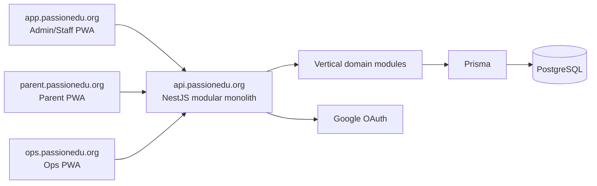
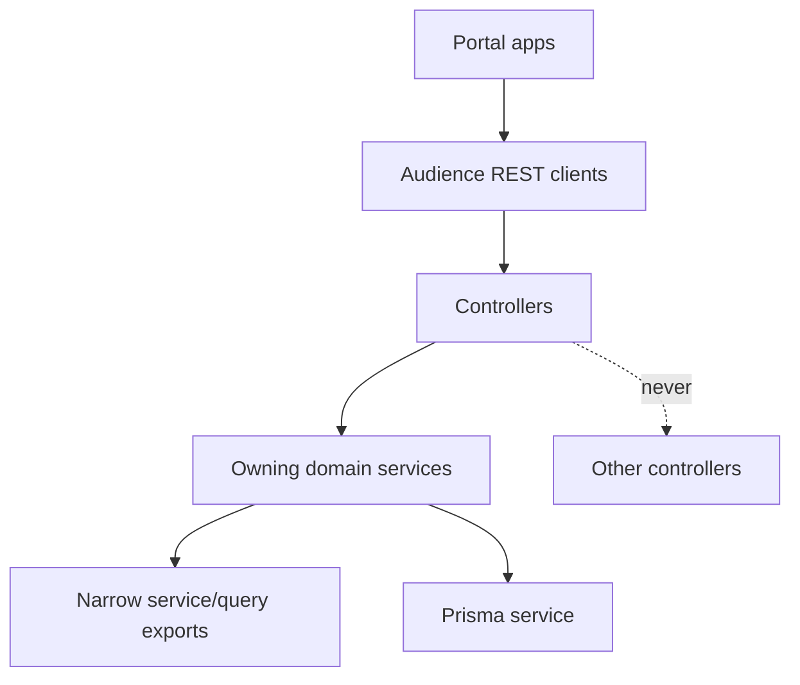
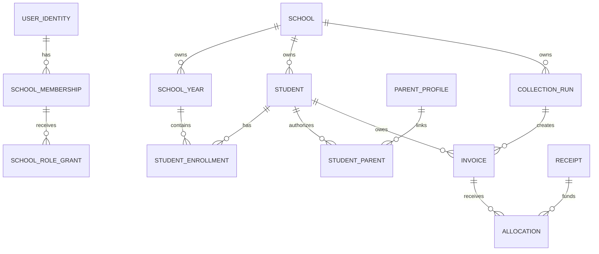
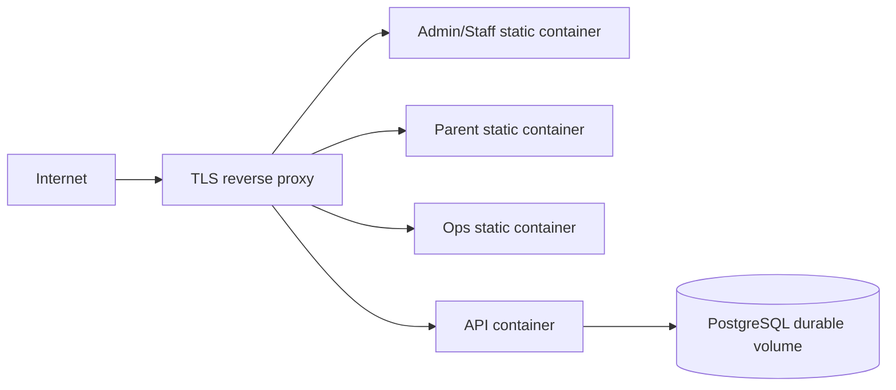

# Architecture Spine - PassionEdu multi-school operations platform

## Design Paradigm

Vertical-slice modular monolith with isolated portal clients. NestJS domain modules own writes and expose narrow service/query contracts; controllers are HTTP adapters only. Admin/Staff, Parent and Ops are separate React/Vite applications that only consume REST.





## Invariants & Rules

### AD-1 - Workspace and portal boundaries [ADOPTED]

- **Binds:** all implementation units
- **Prevents:** frontend access to server data, cross-audience router/session/cache coupling, and shared business logic in browsers
- **Rule:** The pnpm/Turborepo workspace contains `apps/api`, `apps/web` for Admin/Staff, `apps/parent-web` for Parent, and `apps/ops-web` for Operations. Portal applications are separately built/deployed and may share only pure contracts, formatters and stateless UI primitives from `packages`; they never import another app or API internals.

### AD-2 - API ownership and modular dependency direction [ADOPTED]

- **Binds:** FR-1 through FR-15
- **Prevents:** duplicated policy/money rules, controller-to-controller coupling, and ambiguous aggregate ownership
- **Rule:** `apps/api` solely owns Prisma, migrations, PostgreSQL, authorization, policy evaluation, money calculation, state transitions, snapshots, audit and Operations. Domain modules own their aggregate writes: `identity`, `schools`, `memberships`, `authorization`, `roster`, `settings`, `finance`, `attendance`, `parents`, `parent-auth`, `parent-portal`, and `operations`. Controllers call only their owning service; a service may use Prisma and narrowly exported service/query contracts, never another controller.

### AD-3 - School-scoped authorization context [ADOPTED]

- **Binds:** FR-1 through FR-15
- **Prevents:** cross-tenant access through UUIDs, filters, route parameters, headers or stale browser selection
- **Rule:** `School` is the tenant root. Staff operational routes carry `/schools/:schoolId/` and resolve active `SchoolMembership` plus `SchoolRoleGrant`/capability per request. Parent routes carry `/api/parent/schools/:schoolId/`; one `ParentSchoolContext` resolver verifies parent audience, bound ParentProfile and active StudentParent in that School before any scoped query. Every business query, write, unique constraint, audit record and Operation scopes `schoolId`; updates/deletes match both record ID and school ID in one transaction. Client-provided school context is a selector, never authorization proof; no resolver may derive authorization from an unscoped resource UUID.

### AD-4 - Identity, audience and portal session isolation [ADOPTED]

- **Binds:** FR-1, FR-2, FR-6, FR-14, FR-15
- **Prevents:** global Admin privilege, cross-portal cookies, subject/email takeover and stale Parent access
- **Rule:** Google OAuth creates/binds global `UserIdentity`; Staff access requires active membership/role grants resolved per request. `parents` owns ParentProfile and exports the only atomic pending-email bind/reassign command used by `parent-auth`: normalized verified email lookup, unique Google subject and one-to-one identity binding, active StudentParent recheck immediately before session issue, and audited revoke before reassignment. Parent read models enforce retention server-side: operational/sensitive data expires 30 calendar days after enrollment `endedOn`; issued finance remains while unsettled, then uses versioned ParentAccessPolicy with a 12-month default. The fixed hosts are `app.passionedu.org`, `parent.passionedu.org`, `ops.passionedu.org` and `api.passionedu.org`; every audience has its own callback allowlist, host-only `Secure`/`httpOnly`/`SameSite=Lax` cookie, session audience and origin allowlist. A session cookie is accepted only by its audience. `parent-web` never service-worker caches authenticated Parent responses, payment instructions, media or evidence URLs; it clears memory/query state on logout, expiry, `401` or revoke.

### AD-5 - Operations control plane [ADOPTED]

- **Binds:** FR-1 through FR-3
- **Prevents:** Platform Operator access to School business data, partial owner bootstrap and destructive School deletion
- **Rule:** `SUPERADMIN_EMAIL` from environment may bootstrap only `PlatformOperatorGrant`; Ops authorizes through audience `ops` plus that grant and has no `OpsUser` model. Provisioning atomically creates/reuses pending owner UserIdentity, SchoolMembership and `SCHOOL_ADMIN` grant; verified Google login binds the subject. Schools are suspended/reactivated, never hard-deleted; every School-scoped resolver rejects a suspended School on the next business request while the global identity session can remain valid elsewhere. A Platform grant never implies School access.

### AD-6 - Temporal roster and typed policy ownership [ADOPTED]

- **Binds:** FR-4 through FR-6, FR-12, FR-13
- **Prevents:** overwriting roster history, policy JSON blobs and mutable historical operational meaning
- **Rule:** `SchoolYear` is the data boundary; a School has at most one active year, Classes belong to it, and `StudentEnrollment` plus class assignment use effective dates/audit rather than mutable current-state fields. The business timezone is `Asia/Ho_Chi_Minh`; effective intervals are `[effectiveFrom, effectiveTo)`. Finance receives a roster-owned as-of snapshot at CollectionRun generate/issue and persists source IDs/effective facts rather than recomputing from current rows. Student codes are server-generated, School-unique and never reused. Settings are typed domain models with version/effective date/audit; policy changes do not rewrite snapshotted history. Retain Student, Parent, Staff and enrollment through lifecycle status, never hard delete.

### AD-7 - Finance obligation and ledger model [ADOPTED]

- **Binds:** FR-7 through FR-11, FR-15
- **Prevents:** parallel finance lifecycles, mutable issued obligations, float errors, payment double-posting and live account data changing history
- **Rule:** VND persists as PostgreSQL `BIGINT` and crosses REST only as safe JSON integers. Every CollectionRun, Invoice, DebtTransfer and settlement belongs to one SchoolYear; no debt auto-carries to a new SchoolYear. Finance owns CollectionRun lifecycle `DRAFT -> READY -> GENERATED -> CLOSED`: GENERATED locks rule/scope snapshots and only allows one new DRAFT Invoice for an eligible Student without one; CLOSED blocks create/edit. Preview and generate share the same server selection policy and categorized skips. An Invoice is unique by `(schoolId, studentId, collectionRunId)`; obligation content and Payment instruction are immutable after issue, while only server workflows may derive settlement or transition to VOIDED before any allocation/prepayment application. Receipt, Allocation, Prepayment, Reversal, Refund and DebtTransfer are append-only finance records. One finance posting boundary serializes every settlement writer with a consistent lock order and rejects allocation above Receipt/Invoice outstanding, Prepayment application above its source/Invoice outstanding, and cross-Student use; overpayment requires explicit Prepayment. DebtTransfer atomically reduces its source outstanding before exposing `PRIOR_DEBT`, preventing double collection. `DIRECT` permits School Admin/Finance Manager reversal with reason; `SCHOOL_ADMIN_APPROVAL` requires a Finance Manager request and a different School Admin approval, never self-approval. Paid/outstanding status is derived from validated ledger records, never set by clients. Finance source and Payment instruction data are snapshotted at issue; Parent receives a minimal read model only.

### AD-8 - Transaction, idempotency and audit boundary [ADOPTED]

- **Binds:** FR-1 through FR-13
- **Prevents:** duplicate batch/ledger actions after timeout and untraceable privilege/policy/money changes
- **Rule:** State-changing workflows that affect multiple records run in PostgreSQL transactions. CollectionRun generation, roster transition/close year, issue, receipt/allocation, prepayment, reversal/refund, approval and Parent leave mutations require client UUID `Idempotency-Key`. `Operation` scopes School + route + actor type/reference (`SCHOOL_MEMBERSHIP`, `PARENT_PROFILE` or `PLATFORM_OPERATOR_GRANT`), with actor UserIdentity when present; it atomically persists a request fingerprint/outcome, replays identical retries and rejects changed reuses. Operation reads authorize the same actor context that created it. Clients reconcile `GET /operations/:operationId` before retry. Audit stores School, actor identity/reference, timestamp, provenance and required reason.

### AD-9 - Clean-break target schema [ADOPTED]

- **Binds:** all replacement releases
- **Prevents:** legacy single-school schema/API/UI contaminating tenant or ledger contracts
- **Rule:** Prisma schema, committed migrations, seed and modules implement only the target multi-school model. The old global Admin, invoice template, monthly invoice lifecycle and unscoped resources are removed/replaced rather than run in parallel. Development/test databases reset to the target seed. If operational data exists, stop and create a separate onboarding/migration workstream before implementation.

### AD-10 - Pilot VPS deployment boundary [ADOPTED]

- **Binds:** pilot deployment
- **Prevents:** pilot deployment becoming an implicit production claim or violating portal host/session boundaries
- **Rule:** The pilot runs on one VPS with Docker Compose, building portal/API images from repository source on that host. A TLS reverse proxy routes the fixed portal hosts to separate static portal containers and `api.passionedu.org` to the API; PostgreSQL uses a local durable Compose volume. Secrets are injected outside Git. No container registry, offsite backup, restore drill, production SLO or cloud-provider commitment is required for the pilot. Database migrations are applied before the API version that requires them; destructive migration rollback is forbidden. Public/operational production rollout requires an Architecture Spine update that defines recovery, backup, monitoring, delivery and rollback controls.

### AD-11 - Verification boundary [ADOPTED]

- **Binds:** all releases
- **Prevents:** happy-path-only proof and UI-only validation of tenant/ledger invariants
- **Rule:** Pure transitions/calculations use API unit tests; PostgreSQL integration tests prove tenant isolation, scoped uniqueness, revoke, transactions, ledger concurrency and idempotency; portal E2E proves audience/session isolation, chooser/switcher and Parent cross-school behavior. E1 tenant-isolation proof gates all subsequent releases.

### AD-12 - Tenant graph integrity [ADOPTED]

- **Binds:** FR-3 through FR-15
- **Prevents:** tenant-owned records carrying a valid school ID while referencing a different School's aggregate
- **Rule:** Tenant-owned relations use composite `(schoolId, id)` parent keys and foreign keys where supported. The owning command verifies the entire graph inside its transaction when a database composite FK cannot express it. Global exceptions are only UserIdentity, ParentProfile and PlatformOperatorGrant; their tenant path is explicit through SchoolMembership or StudentParent. Cross-School graph inserts and joins are negative integration tests.

### AD-13 - Attendance-to-finance adjustment contract [ADOPTED]

- **Binds:** FR-12, FR-13, FR-7 through FR-11
- **Prevents:** duplicated or wrongly targeted meal adjustments and attendance becoming an unapproved pricing engine
- **Rule:** `attendance` owns immutable leave/attendance eligibility sources and never writes Invoice lines. Leave before the School deadline is auto-approved; leave after it needs the configured approval. Calendar holidays are excluded and a confirmed `PRESENT` creates conflict that excludes that date. `finance` alone materializes a source-linked negative meal adjustment onto the next eligible DRAFT Invoice through an idempotent command keyed by source/day/receivable. The command defines no-target, issued/voided target and retry outcomes, records source provenance and never rematerializes an already handled source. An approved long leave excludes future CollectionRun eligibility; issued obligations use a source-linked adjustment/refund workflow. Attendance, handover and service data remain references for Finance `MANUAL` decisions; they never calculate charges automatically. A manual Saturday charge must validate active StudentServiceEnrollment coverage for that date and rejects duplicate charging for a covered service.

### AD-14 - Attendance evidence lifecycle [ADOPTED]

- **Binds:** FR-12
- **Prevents:** PRESENT without required evidence, Parent/media leaks and indefinite retention of child images
- **Rule:** `attendance` enforces School `photoEvidenceMode` `REQUIRED | OPTIONAL` at the write boundary. Evidence is readable only to attendance-capable Staff or School Admin in the same School, never Parent DTOs or media URLs. Blob/preview is deleted two calendar months after confirmation while deletion metadata remains audited. Integration/E2E proves required-mode rejection, capability/tenant isolation and cleanup.

### AD-15 - Parent attendance notification boundary [ADOPTED]

- **Binds:** FR-12, FR-14
- **Prevents:** notification delivery after revoke, evidence leakage and duplicate Parent event delivery
- **Rule:** `attendance` emits one idempotent in-app notification event after an attendance write; `parent-portal` projects it only for ParentProfiles with an active StudentParent link at read/delivery time. The event contains no evidence media or internal Staff data, respects Parent retention/revoke authorization, and does not introduce SMS, email, Zalo or chat delivery.

### AD-16 - Production envelope is deferred [ADOPTED]

- **Binds:** transition from pilot to public/operational production
- **Prevents:** treating the pilot VPS as production without an explicit operational design
- **Rule:** Production availability, RPO/RTO, backup/audit retention, restore drills, monitoring, rate limits, performance budgets, registry, cloud migration and provider selection are intentionally undecided. They are not pilot acceptance criteria. Before any public or operational production rollout, create an Architecture Spine update that decides and verifies them.

## Consistency Conventions

| Concern | Convention |
| --- | --- |
| Naming | Prisma/domain models are singular PascalCase; REST resources are plural kebab-case; enum values are uppercase; product text is Vietnamese. |
| REST and data | JSON is camelCase. Lists return `{ data, meta }`, actions return `{ data }`, errors return `{ error: { code, message, fieldErrors? } }`. IDs are UUID strings; timestamps are UTC ISO 8601. |
| Authorization | Authenticated operational routes default-deny. Capability checks are server-side at every request. Parent APIs expose minimum DTOs and never reuse Admin business endpoints. |
| Mutation | Cookie mutations require origin validation and double-submit CSRF. High-impact mutations require Idempotency-Key and Operation reconciliation. |
| Database | Prisma schema/migrations live only under `apps/api/prisma`; committed migrations deploy outside local development; `db push` is local-only. |
| Configuration | Environment config is validated at API startup. Real secrets never enter repository, database setting UI or client bundle. |

## Stack

| Name | Version |
| --- | --- |
| Node.js | 22.x |
| pnpm | 11.9.0 |
| Turborepo | 2.8.x |
| TypeScript | 5.9.x |
| React | 19.2.x |
| Vite | 8.2.x |
| TanStack React Query | 5.90.x |
| NestJS | 11.2.x |
| Prisma | 7.9.x |
| PostgreSQL | 16+ |
| Docker Compose | VPS runtime |

## Structural Seed

```text
anhhoa/
  apps/
    api/
      prisma/                 # target schema, migrations, resettable seed
      src/modules/            # vertical domains and narrow exports
    web/                      # Admin/Staff PWA
    parent-web/               # Parent PWA
    ops-web/                  # Platform Operations PWA
  packages/
    contracts/                # pure REST types/validators, no app imports
    ui/                       # stateless visual primitives only
  deploy/
    compose/                  # VPS Compose, proxy and backup operations
```





## Capability → Architecture Map

| Capability / Area | Lives in | Governed by |
| --- | --- | --- |
| Platform provision, suspend and owner bootstrap | `identity`, `schools`, `memberships`, `ops-web` | AD-2, AD-3, AD-4, AD-5, AD-8 |
| School chooser, roles and scoped navigation | `authorization`, `web` | AD-1, AD-3, AD-4, AD-11 |
| School settings, year, roster and Staff | `settings`, `roster`, `web` | AD-2, AD-3, AD-6, AD-8 |
| Catalog, CollectionRun and Invoice issue | `finance`, `web` | AD-2, AD-3, AD-7, AD-8 |
| Receipt, debt, prepayment and reports | `finance`, `web` | AD-2, AD-3, AD-7, AD-8, AD-11 |
| Attendance, leave, service and handover | `attendance`, `roster`, `web` | AD-2, AD-3, AD-6, AD-8 |
| Parent authorization and finance read model | `parents`, `parent-auth`, `parent-portal`, `parent-web` | AD-1, AD-3, AD-4, AD-7, AD-11 |

## Deferred

- VietQR, copy fields and bank deep links: separate Parent enhancement only after snapshot fallback, device/browser matrix and configuration governance are approved.
- Support JIT/impersonation, Organization hierarchy, per-School domains, shared live catalogs, transport, medical, communications and import/onboarding: outside this initiative; require their own product/architecture decision.
- Container registry, reverse-proxy implementation, offsite backup, monitoring, cloud provider and production recovery posture: deferred until a production rollout is planned; they are not pilot prerequisites.
