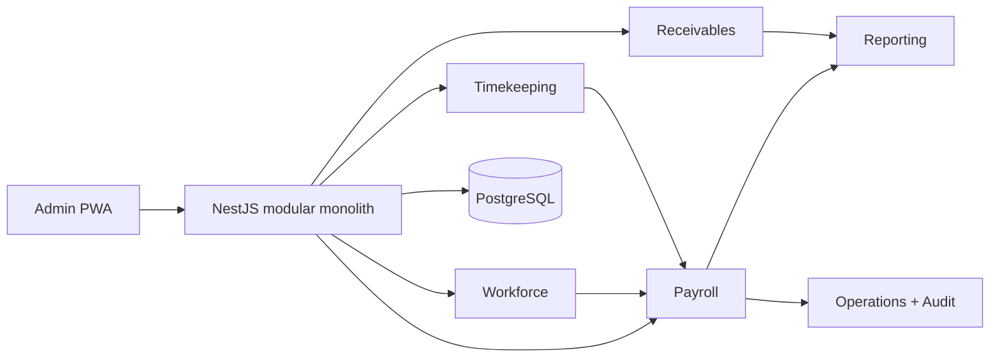
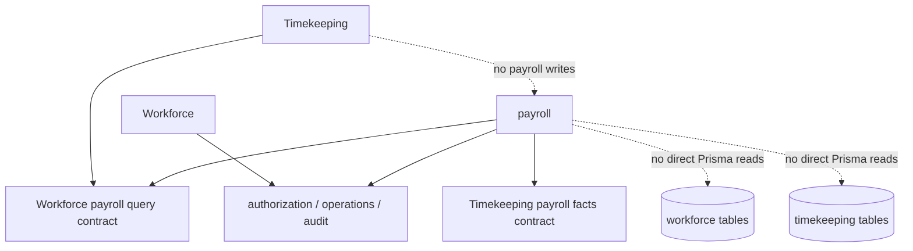
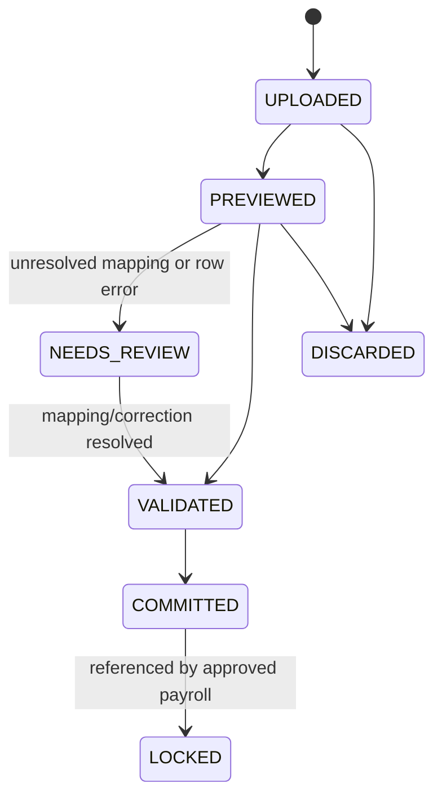
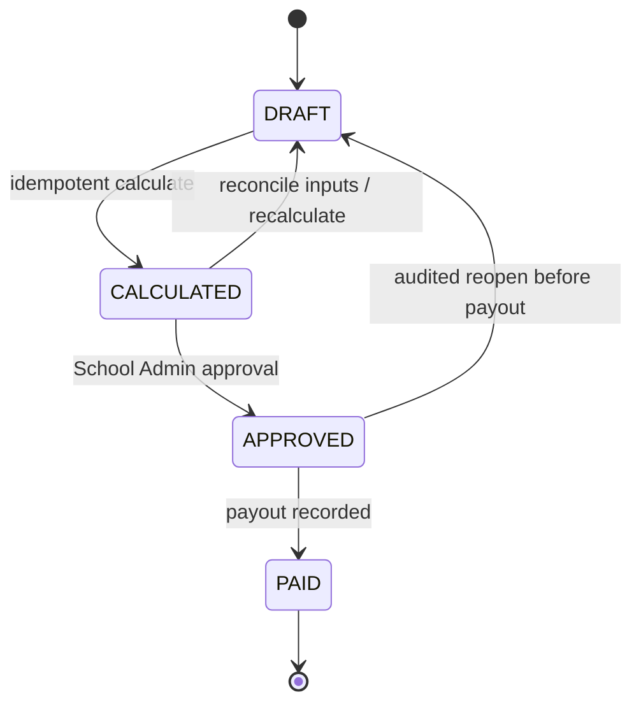

# Payroll Module And Delivery Roadmap

## Purpose

Define the proposed bounded contexts, ownership contracts, immutable payroll data path and phased implementation plan for a Vietnam kindergarten payroll MVP. This is a proposal only. Payroll remains a non-goal in the approved SPEC until PRD, SPEC and Architecture Spine changes are accepted.

## Confirmed MVP Decisions

| Concern | Decision |
| --- | --- |
| Payroll actor | Accountant prepares/reconciles; School Admin gives final approval, reopens an approved unpaid run, and approves post-payment corrections. |
| Tenant | Every payroll, workforce and timekeeping record, relation, audit and Operation is School-scoped. |
| Availability | Payroll is an opt-in School capability. A server-side School feature entitlement and enablement state gates every payroll, workforce and timekeeping route, job and navigation destination; hiding a menu is never the gate. |
| Time source | Accountant/Admin uploads a machine-export file. Direct device integration is deferred. |
| Identifier | Source rows contain machine employee code and display name. A School-managed effective-dated mapping resolves the code to one Staff at a time; name is evidence only and never an authorization or identity key. |
| Raw events | Imported IN/OUT events are append-only. Manual attendance changes are separate audited corrections, never overwrites. |
| Work schedule | One common School work schedule in the MVP. Half-day and hourly work units are deferred. |
| Workday result | Payroll consumes reviewed daily work records, not raw clock events. |
| Late care | Accountant/Admin creates or confirms dated late-care shift assignments. Handover/clock presence may be shown for reconciliation but never automatically establishes a payable assignment. |
| Contract values | Base salary and insurance contribution salary base are independent effective-dated values. |
| Earnings | Base salary, probation salary, fixed allowances, attendance bonus, late-care allowance, manual adjustments and thirteenth-month pay. |
| Deductions | Unpaid leave, salary advance, social/health/unemployment insurance, personal income tax, other manual deductions. |
| Rules | API code evaluates typed, versioned policies. Policy data is schema-validated and effective-dated. Arbitrary expressions/scripts stored in the database are prohibited. |
| Headcount bonus | Deliberately deferred. The policy and calculation extension point is designed now, but no headcount rule is implemented before a School-specific business rule is approved. |
| Corrections | Draft work remains flexible. Approved but unpaid runs require an audited reopen that creates a new run version. Paid runs remain immutable; a separately approved correction run records the payable or recoverable difference. |
| Compliance boundary | The system calculates configured tax/insurance rules, snapshots results and supports reconciliation/export. It does not integrate with tax or social-insurance portals and does not claim certified legal compliance. |

## Architectural Position

Keep the target NestJS/PostgreSQL deployment as a vertical-slice modular monolith. Do not create a payroll microservice. Payroll requires cross-domain facts, but the existing narrow service/query export rule is sufficient while the platform is on one database and one operational team.

Do not add payroll to the existing student receivables `finance` aggregate. Receivables is an accounts-receivable domain with Student-specific exact-settlement rules. Payroll is staff compensation/accounts payable and has independent periods, approval, corrections and payout semantics.

## Optional Capability And Pilot Rollout

Payroll is a licensed/operationally enabled School capability, not a platform-wide release switch. The platform may deploy the payroll code once while only selected Schools are permitted to use it. This supports a controlled trial without making Payroll data or workflows available to every tenant.

| State | Meaning | Server behavior |
| --- | --- | --- |
| `NOT_ENTITLED` | School has not been selected for payroll. | Payroll/workforce/timekeeping business routes and scheduled work return a capability-unavailable error; Admin navigation/API discovery omits the feature. |
| `PILOT_ENABLED` | School is explicitly admitted to the trial. | Authorized actors can use the MVP; release telemetry, reconciliation fixtures and support review are required for the School. |
| `ENABLED` | Payroll is generally available to the School. | Authorized actors can use the released Payroll modules. |
| `SUSPENDED` | New payroll work is stopped temporarily. | New imports, corrections, period creation, calculations, approvals and payouts are denied. Historical approved/paid records remain readable to specifically authorized users; no background job changes data. |
| `RETIRED` | Payroll is permanently turned off after settlement/export. | Read-only retention/export access remains under the School retention policy. Re-enablement requires an explicit audited onboarding decision, not a toggle. |

- The entitlement is resolved with School status, membership and capability on every request. A client route, a stale cached capability response or a known payroll UUID never proves access.
- Platform Operations owns admitting a School to `PILOT_ENABLED`/`ENABLED` and records rollout version, actor, reason and acceptance date. School Admin cannot self-enable a trial feature.
- School Admin may request suspension, but an Ops-authorized transition performs the final state change. This separates a School's business approval from a platform rollout decision.
- Enabling is idempotent and creates no payroll records. It permits configuration only after the School has an active policy owner and required payroll capabilities.
- Suspending or retiring must not delete contracts, raw time events, payroll versions, payouts or audit history. Any approved unpaid run, advance reservation or in-progress import must be resolved through a named operator workflow before the transition completes.
- The system must not permit a School to disable Payroll merely to bypass an approved correction, advance or payout obligation. The transition validates and reports blockers before it changes state.
- This is a targeted capability gate, not a generic feature-flag framework. Do not create arbitrary per-tenant flags or branch business semantics by flag value.



## Module Boundaries

| Module | Owns writes | Narrow exports for other modules | Explicitly does not own |
| --- | --- | --- | --- |
| `roster` | Current target: SchoolYear, Class, Student, enrollment, class assignment. | Read-only effective class/headcount snapshots when a future approved payroll rule needs them. | Employment terms, staff attendance, salary calculations. |
| `workforce` | Staff employment profile, effective-dated employment contracts, compensation terms, fixed allowance terms, machine identifier mappings. | Effective staff/employment/compensation snapshot for a payroll period; active staff lookup for time import. | Raw clock events, workday calculation, payroll entry/payout. |
| `timekeeping` | Import batches, raw clock events, manual corrections, common work schedule policy, reviewed workday records, late-care shift definitions and confirmed assignments. | Locked/reviewed timekeeping and late-care facts for a named payroll period. | Salary formulae, tax/insurance calculation, payment. |
| `payroll` | Payroll policy versions, periods, runs, entries, component snapshots, reconciliation overrides, advances, corrections and payout records. | Payroll read models and aggregate summaries for `reporting`. | Staff master records and source-time mutation. |
| `receivables` | Student invoices, receipts and student debt. | None required by payroll MVP. | Staff compensation, salary advances or payroll payments. |
| `reporting` | Read projections only. | Query DTOs. | Any business write, calculation or approval. |
| `authorization`, `operations`, `audit` | Existing cross-cutting authorization, idempotency/reconciliation and audit primitives. | Guards, Operation workflow and audit commands. | Payroll domain state machines. |
| `school-features` | School feature entitlement/enablement state and pilot admission provenance. | Server-side `requireFeature` decision for routes/jobs and authorized feature discovery. | Payroll data, payroll policy or role capability. |

`workforce` may initially be colocated next to the existing roster implementation because it reuses StaffProfile. It must still expose a separate contract and own employment data. Do not add contracts, compensation, machine codes or salary fields directly to a general `StaffProfile` table.

## Dependency Rules



- Controllers call only their owning domain service.
- A domain service can use Prisma for its own aggregate and a narrow query/command export from another domain. It never imports another domain's controller or writes another domain's tables.
- `timekeeping` publishes reviewed facts. `payroll` snapshots those facts during calculation and never recomputes an issued/approved payroll entry from live source data.
- The browser never calculates attendance eligibility, salary components, insurance, tax, payable total or payout state.
- Payroll, workforce and timekeeping mutation/read services call the narrow `school-features` entitlement export before their domain lookup. Background work takes the same decision before processing a School.

## Core Models And Temporal Rules

All values are tenant-scoped by `schoolId`; money uses PostgreSQL `BIGINT` and JSON-safe integers. All effective intervals use `Asia/Ho_Chi_Minh` and `[effectiveFrom, effectiveTo)`.

| Aggregate | Required facts and invariants |
| --- | --- |
| `EmploymentContract` | One effective contract at a time per Staff in a School. Includes status, contract type, base salary, independent insurance salary base and dates. Never overwrite a term used by a calculated payroll; create a revised effective-dated term. |
| `CompensationTerm` | Effective-dated fixed allowances and probation salary/rate. A contract can have many terms but active terms of the same component must not overlap. |
| `StaffTimeclockIdentifier` | `schoolId`, Staff, source, `machineEmployeeCode`, effective interval. An active `(schoolId, source, machineEmployeeCode)` maps to exactly one Staff for every instant. Source name is stored for reconciliation only. |
| `TimeImportBatch` | Upload metadata, source/checksum, actor, parse result and row-level errors. Draft batches can be removed/replaced. A committed batch remains auditable and cannot be silently deleted. |
| `StaffTimeEvent` | Immutable raw source facts: batch/correction provenance, source code/name, original timestamp, `IN` or `OUT`, and dedupe key. A machine event is unique by `(schoolId, source, externalEventId)` when supplied; otherwise batch row provenance prevents duplicate commit. |
| `StaffTimeCorrection` | Manual addition, exclusion or replacement fact with reason, actor and affected date/event. It never mutates the imported raw event. |
| `StaffWorkdayRecord` | Reviewed outcome for Staff/date: `PRESENT`, `LATE`, `EARLY_LEAVE`, `PAID_LEAVE`, `UNPAID_LEAVE`, `ABSENT_UNEXCUSED` or `MANUAL`; calculation facts and policy version are retained. MVP uses a full workday only. |
| `LateCareShift` / `LateCareShiftAssignment` | School-configured dated shift definition and confirmed Staff assignment. Payroll snapshots assignment/date/rate rule; presence data does not create it automatically. |
| `PayrollPolicyVersion` | Typed, schema-validated, effective-dated attendance bonus, late-care rate, insurance rate/base cap, PIT bracket/reduction and thirteenth-month policy. It is not executable user-authored code. |
| `SalaryAdvance` | Staff, issued amount, paid date, selected deduction period and `remainingAmount`. MVP reserves the full remaining amount once on payroll approval, releases that reservation if the unpaid run reopens, and settles it on payout. The balance allows future instalment support. |
| `PayrollPeriod` | School-scoped regular calendar-month or thirteenth-month period, cutoff/as-of time, policy version and lifecycle. It is not constrained to `SchoolYear`; payroll periods follow employment/calendar obligations rather than student academic years. |
| `PayrollRun` / `PayrollRunVersion` | Versioned calculation result for one period. Contains entries and source snapshot references. Approved versions are immutable. |
| `PayrollEntry` / `PayrollComponent` | One Staff entry per run version. Every component snapshots formula/version/input facts, gross, deductions and net payable. Overrides create audited adjustment components, not mutations of calculated components. |
| `PayrollCorrectionRun` | A separate payable/receivable delta for a paid period with source run/version, reason, accountant preparation and School Admin approval. |
| `PayrollPayout` | Per-entry record of paid/unpaid state, paid amount/date/method/reference/note. It is a payroll payment record, not a Receipt or Student finance posting. |

## Timekeeping Import And Review



- File parsers are source-specific adapters behind a common import command. MVP supports explicitly documented CSV/XLSX templates, rather than attempting to infer any vendor spreadsheet.
- Preview requires explicit mapping review. A source display name mismatch is visible, but a valid effective machine-code mapping is required before commit.
- Imported rows that cannot be parsed, are ambiguous, or resolve to an inactive/mismatched Staff do not become usable time events.
- Accountant/Admin can create manual corrections and review daily outcomes before payroll calculation.
- Draft batches may be discarded or replaced. Committed batches and corrections are retained; once referenced by an approved run they are locked for that run's historical calculation. A later correction leads to an explicit reopen or correction run.

## Payroll Calculation And Correction Workflow



- The Accountant creates a period/run, selects the valid policy/cutoff and calculates from a single transactional source snapshot.
- Calculation creates a new `PayrollRunVersion`; it never overwrites a prior calculated version. A current draft version may be discarded/recalculated while source data remains flexible.
- School Admin alone approves the current calculated version. Approval locks the version, its contracts, workday/late-care/advance facts and policy snapshot for historical use.
- An approved but unpaid run may be reopened only by School Admin with a reason. Reopen makes a new draft version; it does not edit the approved version.
- Once any payout is recorded, its version cannot reopen. An immediate error is handled by a separately versioned correction run that records positive or negative deltas, references the paid source version and follows Accountant -> School Admin approval again. The original run remains `PAID`.
- High-impact mutations include import commit, calculate, approve, reopen, correction approval and payout confirmation. They require UUID `Idempotency-Key`, transaction, audit and `GET /operations/:operationId` reconciliation.

## Typed Policy Extension Strategy

Policies must stay flexible enough for each School without becoming an unsafe formula language.

```text
PayrollPolicyVersion
  attendanceBonus: fixed amount + typed eligibility thresholds
  lateCare: fixed-per-shift | amount-per-minute
  insurance: employee/employer rates + contribution base cap
  pit: typed bracket table + reductions
  thirteenthMonth: fixed amount | eligible-month proportional
  extensions: typed rule payloads selected by policy version
```

- A new rule family, including class-headcount bonus, is introduced by a code-owned `ruleType`, validator, calculator, calculation-version identifier and API test suite.
- A School can configure only the parameters admitted by that rule's schema. It cannot upload JavaScript, SQL, spreadsheet formulas or arbitrary expressions.
- Every calculated component stores rule type, calculator version, policy version and all input facts. This makes later policy/code changes unable to rewrite historical pay.
- Before headcount bonus ships, add an approved domain contract that defines the counting date/range, enrollment statuses, multi-class allocation, transfers and mid-period assignment behavior. Do not infer those rules from current roster tables.

## MVP Calculation Coverage

| Component | MVP treatment |
| --- | --- |
| Base or probation salary | Selected from effective employment/compensation term and prorated only by the explicitly configured workday policy. |
| Paid/unpaid leave and unexcused absence | Derived from reviewed `StaffWorkdayRecord`; paid leave remains payable, unpaid/absence reduces according to policy. |
| Attendance bonus | Typed eligibility from reviewed daily records and common schedule policy. |
| Fixed allowance | Effective contract term snapshot. |
| Late-care allowance | Confirmed assignment count/duration multiplied by configured typed rate. |
| Insurance | Independent insurance salary base with configured policy rates/caps. |
| PIT | Versioned configured brackets/reductions; Accountant compares the result with the existing Excel process and may add an audited adjustment. |
| Salary advance | Reserve `remainingAmount` in its selected period on approval, release it if that unpaid payroll reopens, then decrease the balance atomically on payout. |
| Other adjustment/deduction | Accountant entry with mandatory reason and evidence/reference when applicable; School Admin sees it in approval review. |
| Thirteenth-month pay | Separate `THIRTEENTH` period/run, using typed fixed or eligible-month proportional policy. |

## Authorization And Audit

- Add dedicated capabilities. Suggested MVP: `WORKFORCE_MANAGE`, `TIMEKEEPING_IMPORT`, `TIMEKEEPING_REVIEW`, `LATE_CARE_MANAGE`, `PAYROLL_PREPARE`, `PAYROLL_RECONCILE`, `PAYROLL_APPROVE`, `PAYROLL_REOPEN`, `PAYROLL_PAYOUT_CONFIRM`, `PAYROLL_REPORT_READ`.
- Map `PAYROLL_PREPARE`/`PAYROLL_RECONCILE` to Finance Manager/Accountant access and approval/reopen to School Admin. Capability resolution remains server-side per request; frontend navigation is only a projection.
- Every mutation stores School, actor identity/membership, route/provenance, timestamp and mandatory reason for correction, override, reopen, discard after review and payout reversal/void.
- Payroll API routes are Staff operational routes under `/schools/:schoolId/`; they use the existing origin validation, double-submit CSRF, tenant resolver and Operation contract.
- Payroll DTOs never appear in Parent or Teacher portals. `app` is the only MVP audience.
- Feature enablement does not grant a role or capability. A School with Payroll enabled still denies every action unless its active membership has the required payroll capability.

## Required Verification

| Layer | Required proof |
| --- | --- |
| Unit | Attendance pairing/workday rules, salary component calculation, insurance/PIT brackets, advance balance, correction delta and typed-policy validation. |
| PostgreSQL integration | School isolation for every aggregate/relation, identifier effective-date overlap, import dedupe, concurrent calculate/approve/payout, Operation replay/conflict, locked-source protection and correction provenance. |
| Feature rollout | Non-entitled School denial on direct route/job/UUID access, pilot admission audit, capability denial after enablement, suspension blocker validation, read-only historical access and no deletion on retirement. |
| API/contract | File row error/reporting DTOs, permission denial, required reason, safe VND serialization and immutable approved/paid response shape. |
| Portal E2E | Upload-preview-review-commit, daily manual correction, late-care confirmation, calculate/reconcile/approve, reopen before payout, paid correction run and revoked capability/Switch-School state clearing. |
| Reconciliation fixtures | Compare the same anonymized historical Excel cases with API results: normal month, probation, paid leave, unpaid leave, absence, late care, advance, insurance/PIT adjustment, thirteenth-month and post-payment correction. |

## Delivery Roadmap

The payroll work starts only after the target clean-break foundation has delivered tenant isolation, staff membership/binding, roster Staff profile, typed policies, Operations and audit. It should not be attempted against the legacy single-school schema currently present in the repository.

### Phase 0: Adopt Contract

**Goal:** make payroll a sanctioned build target without weakening existing receivables rules.

- Update PRD/addendum with payroll actors, scope, non-goals, correction semantics and compliance disclaimer.
- Update SPEC: remove payroll from non-goals; add workforce/timekeeping/payroll capability and success signals.
- Update Architecture Spine with the `workforce`, `timekeeping` and `payroll` ownership boundaries, independent non-Student financial semantics and snapshot/correction invariant.
- Update Architecture Spine with the School-scoped Payroll feature entitlement, server-side enforcement and suspend/retire preservation rules.
- Add payroll epics after the existing foundation dependencies. Keep the existing receivables `finance` rules unchanged.
- Obtain a representative anonymized set of current Excel input/output fixtures and have an accountant confirm expected results before coding calculators.

**Exit criteria:** approved artifacts, baseline fixtures, named policy owner for every pilot School and a reviewed activation/suspension runbook.

### Phase 1: Foundation And Workforce Terms

**Goal:** establish safe employment and policy data before importing time or calculating money.

- Deliver E1 tenant/authorization/Operation release gate from the target roadmap.
- Add the targeted Payroll School feature entitlement and prove direct API/job denial for a non-entitled School before any Payroll business feature is released.
- Deliver StaffProfile and effective assignment foundation from E2.
- Add `workforce`: employment contracts, compensation terms, independent insurance base, fixed allowances and effective-date overlap validation.
- Add typed payroll policy version administration with reason/audit and effective dates.
- Add payroll capabilities and Admin PWA navigation guarded by server grants.

**Exit criteria:** contract/policy changes are School-isolated, effective-dated, auditable and cannot rewrite a snapshotted test record.

### Phase 2: Timekeeping And Late Care

**Goal:** turn uploaded clock data into accountant-reviewed payroll source facts.

- Add machine-code mappings and import adapter/template for CSV/XLSX.
- Build upload, preview, row-error, mapping review, commit/discard and import audit workflow.
- Persist raw IN/OUT events and manual corrections append-only.
- Add common schedule policy, daily workday calculation/review and status correction.
- Add late-care shift definitions and dated confirmed assignments.

**Exit criteria:** representative Excel time files reconcile to reviewed workday/late-care facts; malformed, duplicate, cross-School and ambiguous rows cannot enter calculation.

### Phase 3: Regular Payroll MVP

**Goal:** replace the monthly payroll Excel calculation with a controlled draft-to-paid workflow.

- Add regular payroll periods, versioned runs and component snapshots.
- Implement base/probation salary, paid/unpaid leave, attendance bonus, fixed allowance, late-care, insurance, PIT, other deductions and salary advances.
- Add Accountant calculation/reconciliation/override flows and School Admin approval/reopen flows.
- Add payout confirmation and reports/exports that reconcile each component to the source snapshot.
- Implement cross-tenant, idempotency, concurrency and Excel-fixture verification gates.

**Exit criteria:** an accountant can reproduce approved baseline fixtures, explain every component/source, and safely reconcile a timeout without duplicate calculation, approval or payout.

### Phase 4: Corrections And Thirteenth Month

**Goal:** support real operational corrections without rewriting paid history.

- Add paid-period correction runs and delta payout records.
- Add separate thirteenth-month periods/runs with fixed or eligible-month proportional policy.
- Add advance balance carry-forward only if the MVP one-period deduction proves insufficient; do not implement instalments speculatively.
- Add period-close controls and audit/report views for reopened and corrected payroll.

**Exit criteria:** post-payment errors produce auditable deltas and never mutate an original paid version.

### Phase 5: Deferred Extensions

**Goal:** extend only after policy and compliance validation.

- Class-headcount bonus after its School-specific counting/allocation policy is approved.
- Multiple schedules, half-days, hourly work, overtime and leave accrual.
- Direct timeclock vendor adapters/scheduled synchronization.
- Instalment advances, loans, richer expense/AP accounting and bank payout integration.
- Tax/BHXH filing integration or any legal-certification claim, subject to specialist legal/accounting review and a dedicated compliance specification.

## Proposed Epic Sequence

| Epic | Depends on | Scope |
| --- | --- | --- |
| E8 Workforce and payroll policy foundation | E1, E2, E3 | Employment contracts, compensation/insurance bases, fixed allowances, typed payroll policy and capabilities. |
| E9 Staff timekeeping and late-care facts | E8 | Machine-code mapping, XLSX/CSV preview/commit, raw events, corrections, common schedule, workday records and late-care assignments. |
| E10 Regular payroll and payout | E8, E9 | Period/run/version lifecycle, salary components, advances, Accountant reconciliation, School Admin approval/reopen, payout and reports. |
| E11 Payroll corrections and thirteenth-month pay | E10 | Paid-period correction delta, thirteenth-month run and close/reconciliation controls. |
| E12 Payroll extensions | E11 | Headcount rule, advanced schedules/integration/compliance features only after separate approved contracts. |

## Explicit Non-Goals For MVP

- Direct integration with any tax, BHXH, bank or timeclock vendor API.
- Legal certification or automated statutory filing/submission.
- Arbitrary spreadsheet expressions or user-authored executable rules.
- Multiple shifts, partial-day/hourly calculation, overtime, leave accrual or payroll loans/installments.
- Automatic payroll entitlement inferred from child attendance, handover or mere timeclock presence.
- Reusing Student invoices, Receipts, CollectionRuns or exact Student-settlement rules for staff pay.
- Implementing a class-headcount bonus before its school-specific calculation contract is approved.
